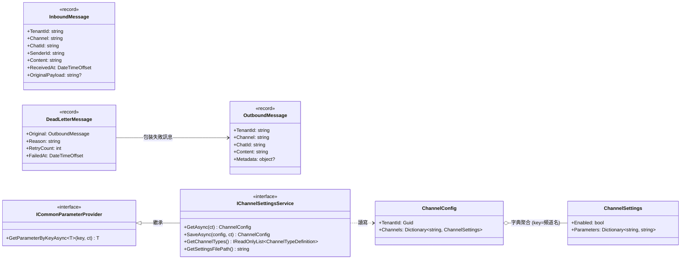
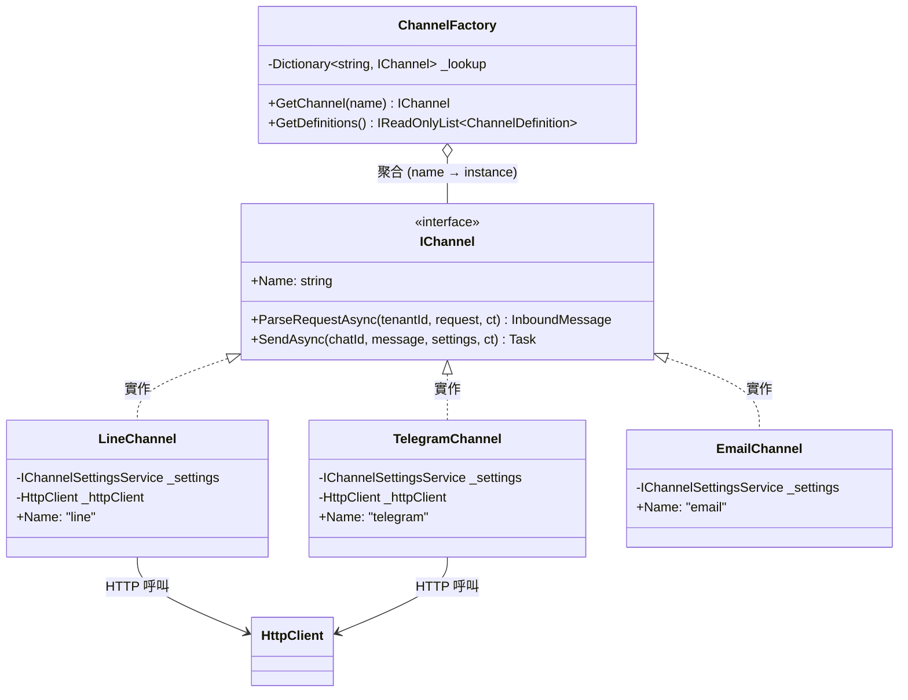
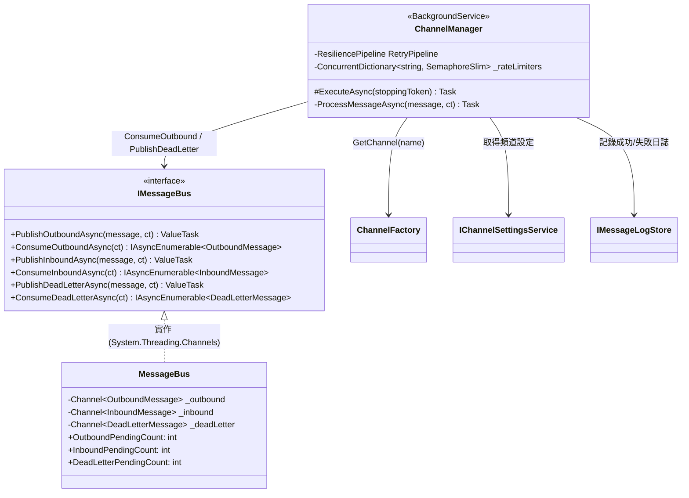
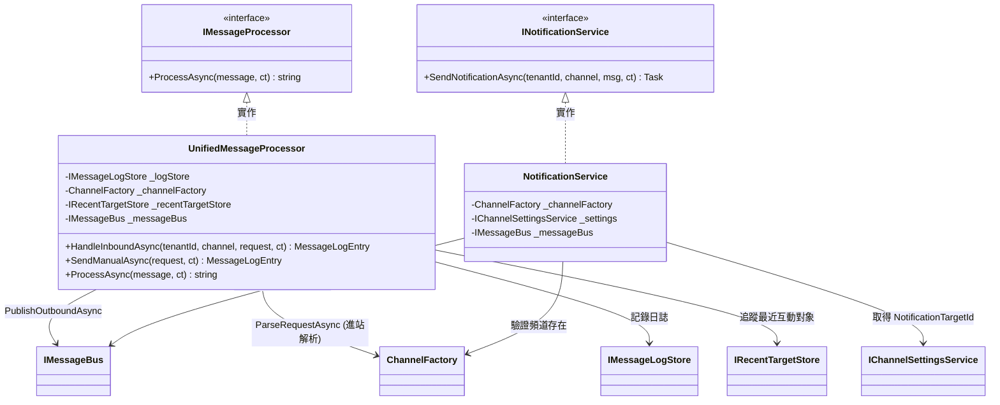
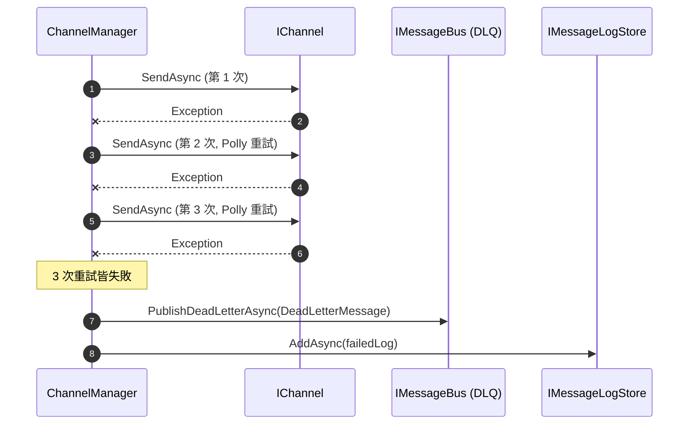
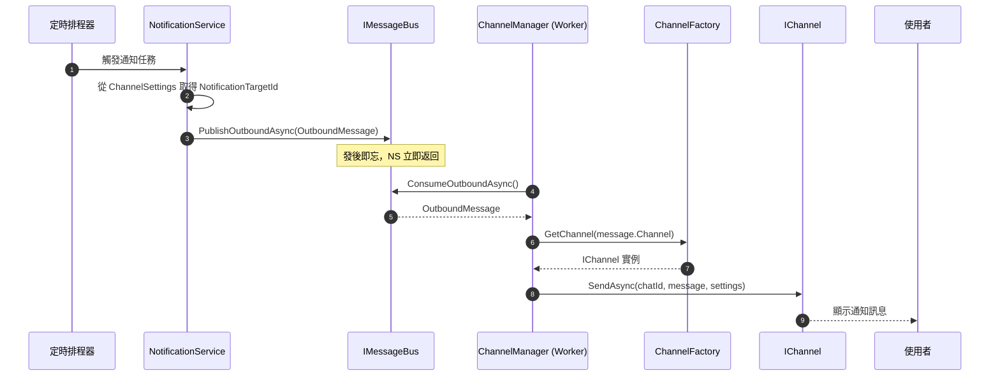
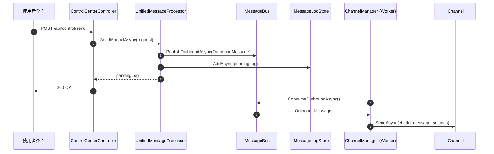

# MessageHub 專案架構說明

> 本文件詳述 MessageHub 專案的實際實作架構，並透過類別圖與循序圖深入說明 Bus 傳輸機制與 Channel 實作關係。

## 1. 專案分層結構 (Project Layers)

本專案採用典型的乾淨架構 (Clean Architecture) 原則：

- **MessageHub.Core**: 核心層。定義所有介面 (Interfaces)、模型 (Models)，並包含大部分業務邏輯實作：頻道 (Channels/)、訊息匯流排 (Bus/)、業務服務 (Services/)、儲存 (Stores/)。不依賴任何外部 NuGet 套件。
- **MessageHub.Infrastructure**: 基礎設施層。僅保留依賴 Polly.Core 的功能 — ChannelManager（背景 Worker：重試 + DLQ + 限流）與 DI 註冊擴充方法。
- **MessageHub.Api**: 外部接口層。提供 ASP.NET Core Controllers 作為系統 Webhook 與手動發送的進入點。

---

## 2. 核心類別圖 (Core Class Diagram)

以下依功能特性拆分為四組類別圖，各圖聚焦單一職責以降低閱讀複雜度。

### 2.1 訊息模型與租戶設定 (Data Models & Configuration)

系統中流動的三種訊息物件，以及多租戶頻道設定結構。



> **設計要點**：`ChannelConfig.Channels` 採 `Dictionary<string, ChannelSettings>` 結構，key 直接對應頻道名稱（如 `"line"`、`"telegram"`），與 JSON 設定檔的結構一致。`DeadLetterMessage` 包裝原始 `OutboundMessage` 加上失敗原因與重試次數，供 DLQ 消費端追蹤。

### 2.2 頻道系統 (Channel System)

`IChannel` 介面定義所有頻道的統一行為，`ChannelFactory` 負責依名稱路由至正確實例。



> **設計要點**：各 Channel 直接實作 `IChannel`（無中間抽象基底類別）。`SendAsync` 回傳 `Task`，失敗時拋出例外而非回傳錯誤物件 — 日誌記錄責任統一由 `ChannelManager` 承擔。新增頻道僅需實作 `IChannel` 並在 DI 註冊，不需修改任何核心邏輯。

### 2.3 訊息匯流排與分發引擎 (Message Bus & Channel Manager)

`IMessageBus` 提供三條佇列（Outbound / Inbound / DLQ），`ChannelManager` 作為背景 Worker 消費 Outbound 並整合重試、限流與死信處理。



> **設計要點**：
> - **Polly 重試**：3 次指數退避（1s → 2s → 4s），針對所有 `Exception`。
> - **Dead Letter Queue**：重試耗盡後，將 `DeadLetterMessage` 發布至 DLQ 通道，並記錄 Failed 日誌。
> - **Per-Channel 限流**：`ConcurrentDictionary<string, SemaphoreSlim>` 確保同一頻道的發送不超過平台限流閥值。
> - **Inbound 通道**：目前預留，未來可用於異步進站處理。
> - **監控**：`MessageBus` 暴露 `OutboundPendingCount`、`InboundPendingCount`、`DeadLetterPendingCount` 作為效能指標。

### 2.4 業務入口與訊息推送 (Business Entry Points)

`UnifiedMessageProcessor` 與 `NotificationService` 作為業務邏輯的兩個入口，皆透過 `IMessageBus.PublishOutboundAsync` 推送訊息，實現「發後即忘」的解耦模式。



> **設計要點**：
> - **UnifiedMessageProcessor**：處理 Webhook 進站（`HandleInboundAsync`）與手動發送（`SendManualAsync`），兩者最終皆透過 Bus 推送，不直接呼叫 `IChannel.SendAsync`。
> - **NotificationService**：從 `ChannelSettings.Parameters` 取得 `NotificationTargetId`，組裝 `OutboundMessage` 後推送至 Bus，實現排程通知的「發後即忘」。
> - 兩者皆不持有 `IChannel` 的發送責任 — 實際發送由 `ChannelManager`（§2.3）背景消費處理。

---

## 3. 重要流程說明 (Sequence Diagrams)

### 3.1 進站訊息與異步回覆 (Inbound → Bus → Outbound)

Webhook 收到訊息後，經 `UnifiedMessageProcessor` 處理，回覆推送至 MessageBus 異步發送。


#### 3.1.1 失敗處理流程 (Dead Letter Queue)



### 3.2 系統主動通知 (Notification → Bus → Channel)



### 3.3 手動發送 (ControlCenter → Bus → Channel)



---

## 4. 異步機制與技術細節 (Implementation Details)

| 技術點 | 實作方式 |
|---|---|
| **訊息匯流排** | `System.Threading.Channels`：`Channel.CreateUnbounded<T>()` 三條佇列 (Outbound/Inbound/DLQ) |
| **頻道註冊** | DI 容器 `AddSingleton<IChannel, XxxChannel>`，`ChannelFactory` 透過 `IEnumerable<IChannel>` 注入建立 name→instance 對照表 |
| **重試機制** | Polly `ResiliencePipeline`：3 次重試、指數退避 (1s → 2s → 4s) |
| **死信佇列** | 重試 3 次仍失敗 → `PublishDeadLetterAsync(DeadLetterMessage)` |
| **限流控制** | `ConcurrentDictionary<string, SemaphoreSlim>` 每頻道一把鎖，確保不超過平台限流閥值 |
| **多租戶** | `OutboundMessage` 含 `TenantId`，`ChannelManager` 透過 `IChannelSettingsService` 動態取得對應租戶設定 |
| **監控指標** | `MessageBus.OutboundPendingCount`、`InboundPendingCount`、`DeadLetterPendingCount` |

---

## 5. 設計決策摘要

1. **訊息解耦 (Fire and Forget)**: 所有發送動作皆透過 `IMessageBus.PublishOutboundAsync` 推送，業務層不需等待外部 API 響應。`WebhookController`、`NotificationService`、`SendManualAsync` 均遵循此模式。
2. **工廠模式**: `ChannelFactory` 隔離具體頻道實作。新增頻道（如 Slack, SMS）僅需實作 `IChannel` 並在 DI 註冊即可，不需修改核心邏輯。
3. **多租戶支持**: 資料模型皆包含 `TenantId`，透過 `IChannelSettingsService` 動態載入各租戶的 API Key 與 Token。`ChannelConfig.Channels` 採 `Dictionary<string, ChannelSettings>` 結構，key 為頻道名稱（如 `"line"`、`"telegram"`）。
4. **Channel 職責單純化**: `IChannel.SendAsync` 回傳 `Task`（而非 `Task<MessageLogEntry>`），失敗時拋出例外。日誌記錄由 `ChannelManager` 統一負責，避免各 Channel 分散處理。
5. **彈性與容錯**: `ChannelManager` 整合 Polly 重試 + Dead Letter Queue + Per-Channel 限流，三道防線確保生產環境穩定性。

---

## 6. 設定檔結構 (JSON Configuration)

存於租戶設定的 `ConfigsJson` 欄位，`ChannelConfig.Channels` 為字典結構：

```json
{
  "channels": {
    "line": {
      "enabled": true,
      "parameters": {
        "ChannelAccessToken": "...",
        "ChannelSecret": "...",
        "NotificationTargetId": "U12345678..."
      }
    },
    "telegram": {
      "enabled": true,
      "parameters": {
        "BotToken": "...",
        "NotificationTargetId": "-1001234567"
      }
    },
    "email": {
      "enabled": false,
      "parameters": {
        "SmtpHost": "...",
        "SmtpPort": "587"
      }
    }
  }
}
```

---

## 7. 類別清單 (Class Inventory)

### 7.1 核心介面 (MessageHub.Core)

| 介面 | 用途 |
|---|---|
| `IChannel` | 頻道通用介面。Name、ParseRequestAsync、SendAsync(chatId, message, settings) → Task |
| `IMessageBus` | 訊息匯流排。Outbound / Inbound / DLQ 三組 Publish + Consume |
| `IMessageProcessor` | 訊息處理入口。ProcessAsync(InboundMessage) → string |
| `INotificationService` | 通知服務。SendNotificationAsync 推送至 Bus |
| `ICommonParameterProvider` | 參數提供者。GetParameterByKeyAsync\<T\>(key) |
| `IChannelSettingsService` | 頻道設定服務（繼承 ICommonParameterProvider）。Get/Save/GetChannelTypes |
| `IChannelSettingsStore` | 頻道設定儲存層介面 |
| `IMessageLogStore` | 訊息紀錄儲存介面。AddAsync / GetRecentAsync |
| `IRecentTargetStore` | 最近互動對象儲存介面 |
| `IWebhookVerificationService` | Webhook 驗證服務介面 |

### 7.2 資料模型 (MessageHub.Core/Models)

| 模型 | 型別 | 欄位 |
|---|---|---|
| `OutboundMessage` | record | TenantId, Channel, ChatId, Content, Metadata? |
| `InboundMessage` | record | TenantId, Channel, ChatId, SenderId, Content, ReceivedAt, OriginalPayload? |
| `DeadLetterMessage` | record | Original (OutboundMessage), Reason, RetryCount, FailedAt |
| `ChannelConfig` | class | TenantId (Guid), Channels (Dictionary\<string, ChannelSettings\>) |
| `ChannelSettings` | class | Enabled (bool), Parameters (Dictionary\<string, string\>) |
| `MessageLogEntry` | record | Id, Timestamp, TenantId, Channel, Direction, Status, TargetId, Content, Source, Details? |
| `SendMessageRequest` | record | TenantId, Channel, TargetId, Content, TriggeredBy? |
| `WebhookTextMessageRequest` | record | ChatId, SenderId, Content |
| `DeliveryStatus` | enum | Pending, Delivered, Failed |
| `MessageDirection` | enum | Inbound, Outbound, System |

### 7.3 業務服務實作 (MessageHub.Core/Services)

| 類別 | 用途 |
|---|---|
| `UnifiedMessageProcessor` | 實作 IMessageProcessor。HandleInboundAsync 處理 Webhook → Bus、SendManualAsync 手動發送 → Bus、ProcessAsync 產生回覆 |
| `ChannelSettingsService` | 實作 IChannelSettingsService。讀取/儲存頻道設定 JSON、正規化 legacy key 名稱 |

### 7.4 頻道實作 (MessageHub.Core/Channels)

| 類別 | 用途 |
|---|---|
| `LineChannel` | 實作 IChannel。Line Messaging API (Push) |
| `TelegramChannel` | 實作 IChannel。Telegram Bot API (sendMessage) |
| `EmailChannel` | 實作 IChannel。Email 模擬通道 (POC) |
| `NotificationService` | 實作 INotificationService。取得 NotificationTargetId → PublishOutboundAsync |
| `WebhookVerificationService` | 實作 IWebhookVerificationService |

### 7.5 訊息匯流排實作 (MessageHub.Core/Bus)

| 類別 | 用途 |
|---|---|
| `MessageBus` | 實作 IMessageBus。三條 `System.Threading.Channels` 佇列 + 監控計數 |

### 7.6 儲存實作 (MessageHub.Core/Stores)

| 類別 | 用途 |
|---|---|
| `InMemoryMessageLogStore` | 實作 IMessageLogStore (記憶體) |
| `JsonChannelSettingsStore` | 實作 IChannelSettingsStore (JSON 檔案) |
| `RecentTargetStore` | 實作 IRecentTargetStore (記憶體) |

### 7.7 基礎設施層實作 (MessageHub.Infrastructure)

| 類別 | 用途 |
|---|---|
| `ChannelManager` | BackgroundService。消費 Outbound → Polly 重試 → 限流 → DLQ → 日誌 |
| `DependencyInjection` | AddMessageHubInfrastructure 擴充方法，註冊所有 Core + Infrastructure 服務 |

### 7.8 API 層 (MessageHub.Api)

| Controller | 路由 | 用途 |
|---|---|---|
| `TelegramWebhookController` | POST /api/telegram/webhook | 解析 Telegram Update → HandleInboundAsync |
| `LineWebhookController` | POST /api/line/webhook | 解析 Line Events → HandleInboundAsync |
| `ControlCenterController` | /api/control/* | 手動發送、查看日誌、管理設定 |
| `WebhooksController` | /api/webhooks/* | 通用 Webhook 文字訊息接收端點（適合 Postman 測試） |

---

## 8. DI 註冊 (DependencyInjection)

```csharp
public static IServiceCollection AddMessageHubInfrastructure(this IServiceCollection services)
{
    // Stores
    services.AddSingleton<IMessageLogStore, InMemoryMessageLogStore>();
    services.AddSingleton<IRecentTargetStore, RecentTargetStore>();
    services.AddSingleton<IChannelSettingsStore, JsonChannelSettingsStore>();

    // Channels
    services.AddSingleton<IChannel, TelegramChannel>();
    services.AddSingleton<IChannel, LineChannel>();
    services.AddSingleton<IChannel, EmailChannel>();
    services.AddSingleton<ChannelFactory>();

    // MessageBus (三通道: Outbound + Inbound + DLQ)
    services.AddSingleton<MessageBus>();
    services.AddSingleton<IMessageBus>(sp => sp.GetRequiredService<MessageBus>());

    // ChannelManager (背景 Worker: Polly 重試 + DLQ + 限流)
    services.AddHostedService<ChannelManager>();

    // Services
    services.AddSingleton<INotificationService, NotificationService>();
    services.AddSingleton<IWebhookVerificationService, WebhookVerificationService>();

    return services;
}
```

---

## 9. 實作路徑參考

| 類別 | 路徑 |
|---|---|
| 核心介面 | `src/MessageHub.Core/` |
| 資料模型 | `src/MessageHub.Core/Models/` |
| 業務服務 | `src/MessageHub.Core/Services/` |
| 頻道實作 | `src/MessageHub.Core/Channels/` |
| Bus 實作 | `src/MessageHub.Core/Bus/MessageBus.cs` |
| 儲存實作 | `src/MessageHub.Core/Stores/` |
| 背景處理 | `src/MessageHub.Infrastructure/ChannelManager.cs` |
| DI 註冊 | `src/MessageHub.Infrastructure/DependencyInjection.cs` |
| API 進入點 | `src/MessageHub.Api/Controllers/` |
| 測試 | `tests/MessageHub.Tests/` |
