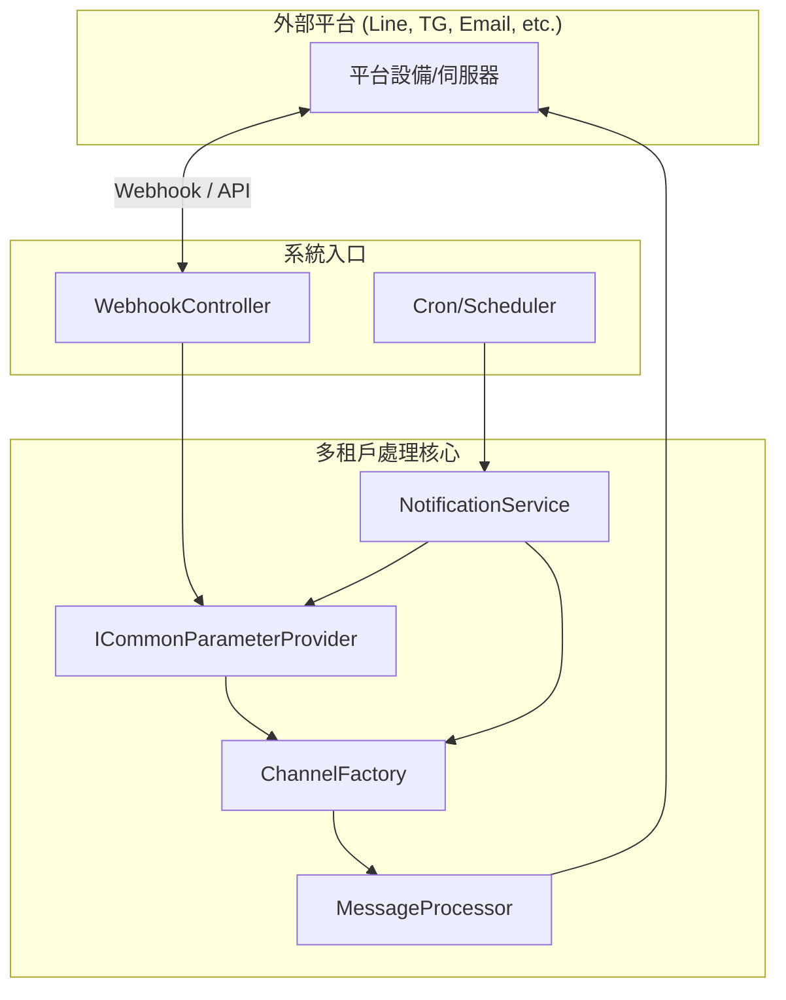
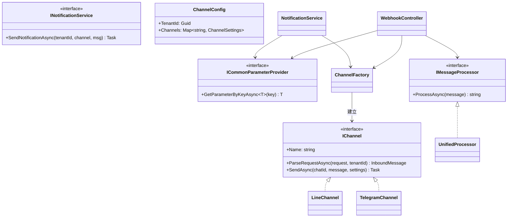
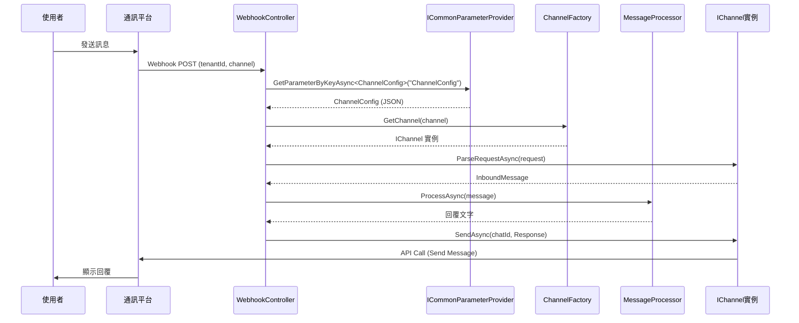
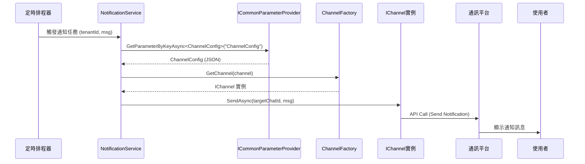
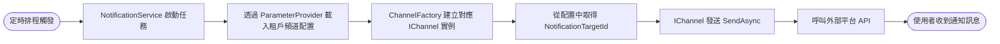
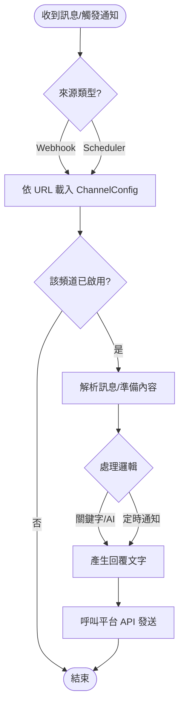

# 聊天頻道系統規格書 (C# 多租戶版本)

> 本文件描述基於 .NET 8/9 的多租戶聊天頻道子系統設計。  
> 支援 Line, Telegram, Email, Slack, FTP, SFTP 等多種頻道，具備處理使用者訊息與系統主動通知之能力。

---

## 1. 系統架構圖 (System Overview)



---

## 2. 類別圖 (Class Diagram)



---

## 3. 循序圖 (Sequence Diagrams)

### 3.1 使用者訊息發送與系統回應 (Inbound)



#### 3.1.1 處理流程圖 (Inbound Flowchart)

```mermaid
flowchart LR
    Start([通訊平台 Webhook 呼叫]) --> Receive[WebhookController 接收請求]
    Receive --> LoadConfig[透過 ParameterProvider 載入租戶頻道配置]
    LoadConfig --> GetChannel[ChannelFactory 建立對應 IChannel 實例]
    GetChannel --> Parse[IChannel 解析 Request 為 InboundMessage]
    Parse --> Process[IMessageProcessor 處理訊息並產生回覆文字]
    Process --> Send[IChannel 發送 SendAsync]
    Send --> Platform[呼叫外部平台 API]
    Platform --> End([使用者收到回覆])
```



### 3.2 系統主動定時發送通知 (Outbound/Notification)



#### 3.2.1 定時通知流程圖 (Notification Flowchart)



---

## 4. 訊息接收決策流程圖 (Flowchart)



---

## 5. 資料結構 (JSON 設定範例)

存於 `Tenants` 資料表的 `ConfigsJson` 欄位：

```json
{
  "channels": {
    "line": {
      "enabled": true,
      "parameters": {
        "channelToken": "...",
        "channelSecret": "...",
        "NotificationTargetId": "U12345678..."
      }
    },
    "telegram": {
      "enabled": true,
      "parameters": {
        "botToken": "...",
        "NotificationTargetId": "-1001234567"
      }
    }
  }
}
```

---

## 6. 類別清單 (Class List)

以下列出系統中主要的參與類別與介面：

### 6.1 基礎介面 (Core Interfaces)

| 類別/介面名稱 | 用途簡述 | 類別描述（功能與屬性） |
| :--- | :--- | :--- |
| `IChannel` | 頻道通用介面 | 定義所有通訊頻道的基礎行為。<br>• `Name`: 頻道識別名稱 (如 Line, Telegram)。<br>• `ParseRequestAsync`: 解析來自平台的 Webhook 請求並轉換為 `InboundMessage`。<br>• `SendAsync`: 發送 `OutboundMessage` 到指定的 `ChatId`。 |
| `ICommonParameterProvider` | 參數提供者 | 負責依鍵值 (Key) 異步獲取多租戶環境下的配置參數。<br>• `GetParameterByKeyAsync<T>`: 泛型方法，用於讀取特定的配置物件 (如 `ChannelConfig`)。 |
| `IMessageProcessor` | 訊息處理介面 | 定義對接收到的訊息進行商業邏輯處理的入口。<br>• `ProcessAsync`: 接收 `InboundMessage` 並回傳處理後的回覆文字。 |
| `INotificationService` | 通知服務介面 | 定義系統主動發送通知的標準行為。<br>• `SendGlobalNotificationAsync`: 根據租戶與頻道發送通知文字。 |

### 6.2 核心實作與邏輯 (Core Logic)

| 類別/介面名稱 | 用途簡述 | 類別描述（功能與屬性） |
| :--- | :--- | :--- |
| `ChannelFactory` | 頻道工廠 | 負責根據配置中的頻道名稱動態建立或取得對應的 `IChannel` 實例。<br>• `GetChannel`: 根據輸入字串回傳對應的頻道物件，若不支援則拋出異常。 |
| `UnifiedMessageProcessor` | 統一訊息處理核心 | 實現 `IMessageProcessor`，整合關鍵字、AI 分析或自動化腳本來決定回覆內容。<br>• `ProcessAsync`: 核心邏輯所在，封裝了處理進站訊息的所有判斷流程。 |
| `NotificationService` | 主動通知服務實作 | 實現 `INotificationService`。結合 `ChannelFactory` 與 `ICommonParameterProvider`。<br>• `SendGlobalNotificationAsync`: 從配置中尋找 `NotificationTargetId` 並發送訊息。 |
| `WebhookController` | Webhook 進入點 | 繼承自 `ControllerBase`，負責接收外部 HTTP POST 請求。<br>• `Handle`: 協調 `ParameterProvider` (取得配置)、`Channel` (解析訊息)、`Processor` (產生內容) 並完成發送。 |

### 6.3 資料模型 (Data Models)

| 類別/介面名稱 | 用途簡述 | 類別描述（功能與屬性） |
| :--- | :--- | :--- |
| `ChannelConfig` | 頻道總體配置 | 映射資料庫中 `Tenants` 表的 JSON 內容。<br>• `TenantId`: 租戶唯一識別碼。<br>• `Channels`: 儲存各頻道名稱與其對應 `ChannelSettings` 的字典。 |
| `ChannelSettings` | 頻道個別設定 | 存放單一頻道的開關與參數。<br>• `Enabled`: 是否啟用該頻道。<br>• `Parameters`: 儲存如 `Token`, `Secret`, `NotificationTargetId` 等字串參數。 |
| `InboundMessage` | 進站訊息封裝 | 標準化不同平台傳入的訊息資訊。<br>• `Content`: 訊息文字。<br>• `ChatId`: 對話識別碼。<br>• `OriginalPayload`: 原始原始請求物件。 |
| `OutboundMessage` | 出站訊息封裝 | 封裝準備發送至通訊平台的訊息。<br>• `Content`: 內容文字。<br>• `TargetId`: 發送對象 ID (可選)。 |

### 6.4 頻道具體實作 (Channel Providers)

| 類別/介面名稱 | 用途簡述 | 類別描述（功能與屬性） |
| :--- | :--- | :--- |
| `LineChannel` | Line 頻道實作 | 專門處理 Line Messaging API 的邏輯。<br>• 包含 Signature 驗證、LineEvent 解析與 API 呼叫。 |
| `TelegramChannel` | Telegram 頻道實作 | 專門處理 Telegram Bot API 的邏輯。<br>• 包含 Telegram Update 解析與 Bot Client 發送訊息。 |
