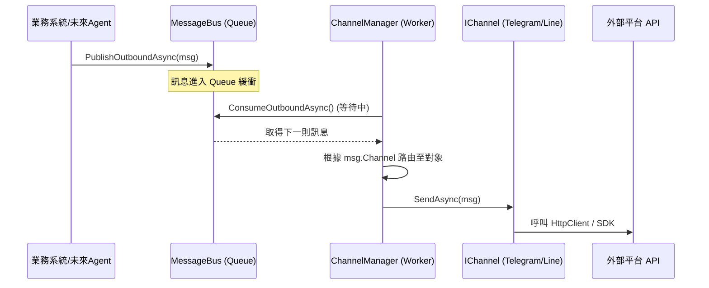

# C# 訊息匯流排與渠道管理架構設計 (基於 nanobot 理念)

> **設計目標**：借鑑 Python `nanobot` 的解耦模式，在 C# 中實作一個高效、可擴展且具備多租戶支援的訊息發布系統。

---

## 1. 核心理念：異步與解耦 (Core Philosophy)

本設計的核心在於將「業務邏輯（誰要發訊息）」與「渠道實作（怎麼發訊息）」完全隔離。

1.  **訊息匯流排 (Message Bus)**：作為系統的中央通訊站，提供 `Inbound` (進站) 與 `Outbound` (出站) 兩個緩衝佇列。
2.  **渠道管理員 (Channel Manager)**：作為後台服務，負責監聽 Bus 上的訊息，並根據訊息指示分發到對應的實體渠道。
3.  **實體渠道 (Channels)**：負責與外部 API (如 Telegram API) 對接的適配器。

---

## 2. 核心組件設計 (Core Components)

### 2.1 訊息物件 (Message Models)
在 C# 中，使用 `record` 或 `class` 定義統一的資料結構。

```csharp
public record OutboundMessage(
    string Channel,         // 標記發送到哪個平台 (e.g., "telegram")
    string ChatId,           // 目標使用者或群組 ID
    string Content,         // 訊息內容
    object? Metadata = null // 額外的平台特定參數
);
```

### 2.2 訊息匯流排 (IMessageBus)
利用 .NET 的 `System.Threading.Channels` 提供高性能的生產者/消費者模型。

```csharp
public interface IMessageBus
{
    ValueTask PublishOutboundAsync(OutboundMessage message);
    IAsyncEnumerable<OutboundMessage> ConsumeOutboundAsync(CancellationToken ct);
}

// 實作類別會封裝 Channel<OutboundMessage>.CreateUnbounded()
```

### 2.3 渠道註冊與探索 (Channel Registry & Discovery)
在 C# 中，由於強型別特性，你需要一個機制來對應「字串名稱」與「類別實體」。

*   **實作建議**：利用 .NET 的依賴注入 (DI) 容器。
*   **做法**：在啟動時將所有 `IChannel` 實作註冊為 `Transient` 或 `Singleton`。
*   **關鍵程式碼**：
    ```csharp
    // 在 Program.cs 或 Startup.cs 註冊
    services.AddKeyedTransient<IChannel, TelegramChannel>("telegram");
    services.AddKeyedTransient<IChannel, LineChannel>("line");
    ```

### 2.5 失敗處理與彈性 (Resilience)
為了確保生產環境的穩定性，發送流程必須具備容錯能力。

*   **重試原則**：針對網路瞬斷 (Transient errors) 應實施「指數退避」重試。
*   **死信佇列 (Dead Letter Queue)**：發送多次（例如 3 次）仍失敗的訊息，應從 Bus 中取出並持久化到資料庫，標記為 `Failed` 供人工後續追蹤。
*   **流量控制 (Rate Limiting)**：每個頻道實作內部應維護自己的 `SemaphoreSlim` 或 Token Bucket 邏輯，確保不超過特定平台（如 Line 每秒 50 則）的限流閥值。

---

## 3. 架構運作流程 (Architecture Flow)

### 出站訊息 (Outbound) 運作邏輯
不論系統現在是做通知還是未來做 Agent，發布流程如下：



---

## 4. C# 重現關鍵技術點 (Implementation Tips)

1.  **使用 `System.Threading.Channels`**：這是 .NET 內建最適合做 Bus 的工具，比 `ConcurrentQueue` 更優雅且支援非同步。
2.  **利用 `Microsoft.Extensions.DependencyInjection` (Keyed Services)**：
    *   .NET 8 導入了 `AddKeyedTransient`，非常適合用來解決「根據字串（如 "telegram"）獲取服務實體」的問題。
3.  **多租戶適配**：
    *   在 `OutboundMessage` 中加入 `TenantId` 欄位。
    *   `ChannelManager` 在調度時，應傳遞 `TenantId` 給 `ICommonParameterProvider` 以獲取正確的租戶金鑰。
4.  **彈性與監控 (Resilience & Logging)**：
    *   **Polly 整合**：在 `IChannel.SendAsync` 內部使用 `Polly` 的 `RetryPolicy`。
    *   **非同步監控**：`MessageBus` 的 `Channel.Reader.Count` 可用來監控目前系統的堆積量，做為效能指標 (Metrics)。

---

## 5. 與原有 `CHANNEL_SYSTEM_CS_MULTITENANT.md` 的整合

原文件中已定義了 `IChannel` 與 `ChannelFactory`。借鑑 `nanobot` 後：
*   **原本的 `NotificationService`**：不再直接呼叫 `IChannel.SendAsync`，而是改為呼叫 `IMessageBus.PublishOutboundAsync`。
*   **優點**：訊息發布變成了「發後即忘 (Fire and Forget)」，大幅提升業務邏輯的響應速度與穩定性。
