# MessageHub.Api 專案架構與運作機制文件

> 此文件由程式碼自動分析產生，最後更新：2026-03-24

## 1. 專案概述

`MessageHub.Api` 是整個系統的進入點，負責對外提供 RESTful API 服務。它的主要職責包括接收來自外部通訊軟體（如 LINE、Telegram）的 Webhook 通知、提供管理介面所需的控制端點，以及處理手動發送訊息的請求。

### 與其他層級的關係
- **Core 層**: API 層依賴 Core 層定義的 `IMessagingService` 與 `IHistoryService` 來處理核心業務邏輯。
- **Domain 層**: 使用 Domain 層定義的實體（Entities）與資料模型。
- **Infrastructure 層**: 透過相依性注入（DI）與實作層解耦，處理資料庫存取與外部 API 呼叫。
- **Worker 層**: API 層透過 `IMessageBus` 與 Worker 層的 `ChannelManager` 進行非同步解耦，確保 API 回應速度並提升系統彈性。

## 2. Program.cs 啟動流程

系統啟動時會執行以下步驟：

1.  **服務註冊 (DI Registration)**:
    - `AddControllers()`: 註冊 MVC Controller。
    - `AddSwaggerGen()`: 產生 API 文件。
    - `AddMessageHubCore()`: 註冊核心邏輯服務（如 `IMessagingService`）。
    - `AddMessageHubInfrastructure()`: 註冊基礎設施（如 Repository、Database Context）。
    - `AddMessageHubDomain()`: 註冊領域模型相關組件。
    - `AddMessageHubWorker()`: 註冊背景工作服務（如 `ChannelManager`）。

2.  **資料庫初始化**:
    - 呼叫 `InitializeDatabaseAsync()` 以確保資料庫與資料表結構已正確建立。

3.  **Middleware Pipeline 配置**:
    - 開發環境啟用 Swagger UI。
    - 啟用靜態檔案支援（`UseDefaultFiles`, `UseStaticFiles`）。
    - 啟用授權機制（`UseAuthorization`）。
    - 對應路徑到對應的 Controller（`MapControllers`）。
    - 設定 `/health` 檢查端點。

## 3. Controller 詳細說明

### 3.1 ControlCenterController (`api/control`)
提供系統管理功能，包含頻道查詢、記錄檢視與設定管理。

#### 3.1.1 GET `channels`
取得系統中所有可用的通訊頻道。

**流程圖**:
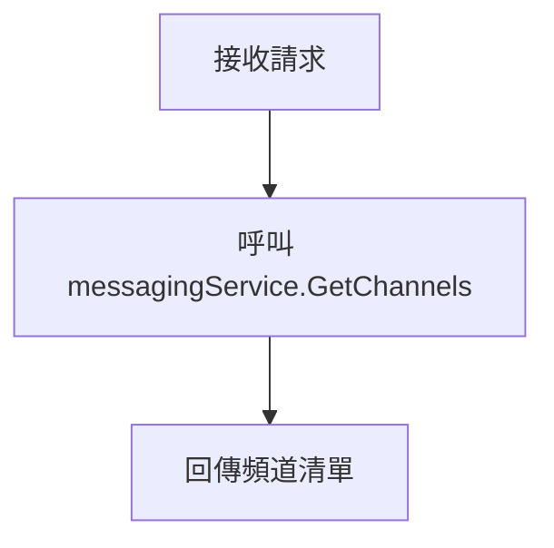

**循序圖**:
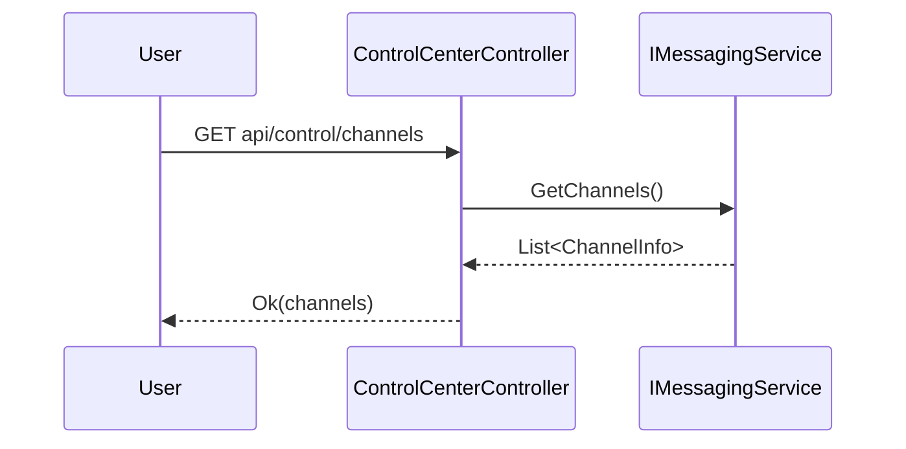

#### 3.1.2 GET `logs`
取得最近的訊息發送記錄。

**流程圖**:
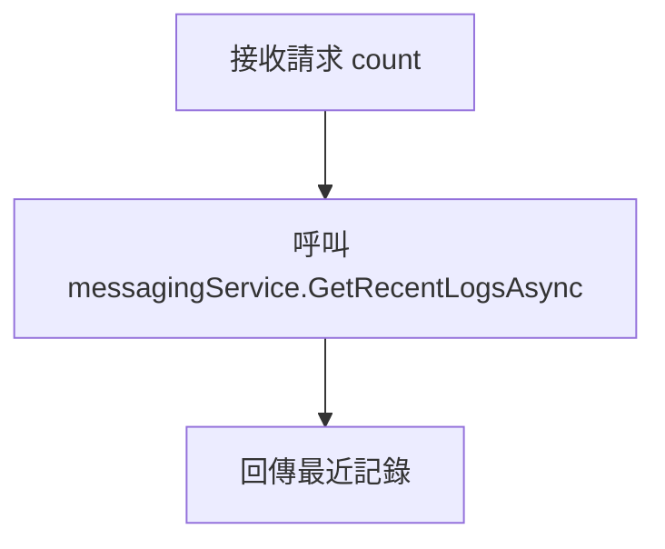

**循序圖**:
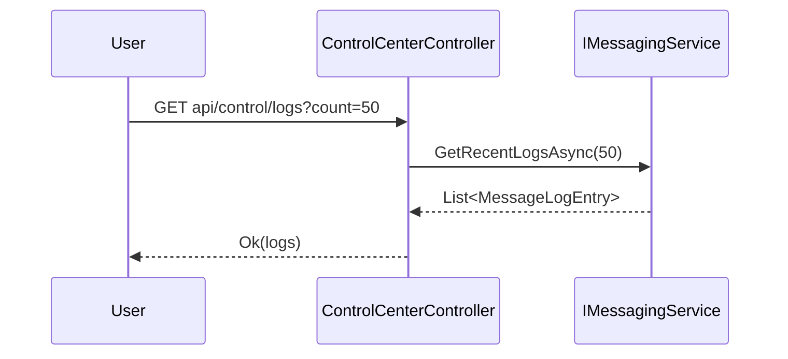

#### 3.1.3 POST `send`
手動發送訊息。

**流程圖**:
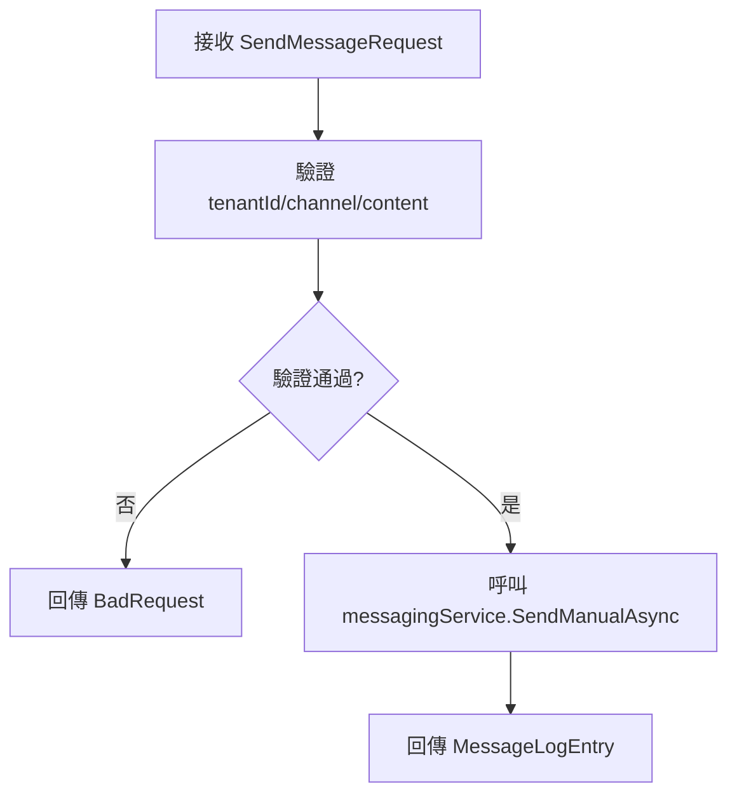

**循序圖**:
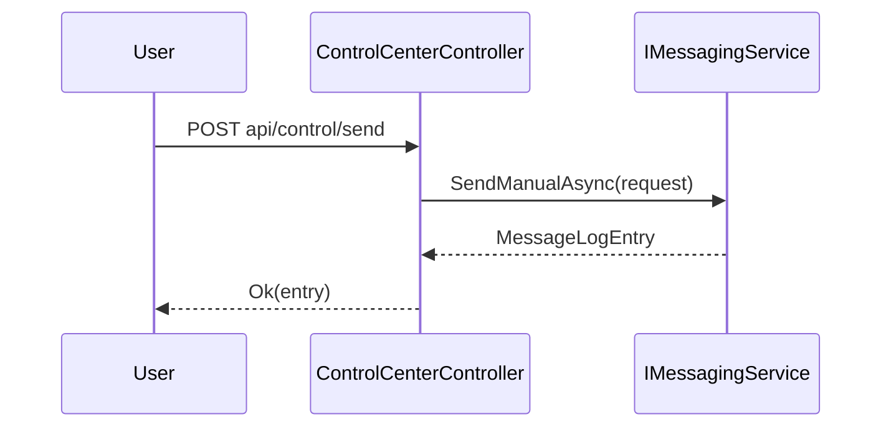

#### 3.1.4 GET `channel-settings`
取得目前的頻道配置設定。

**流程圖**:
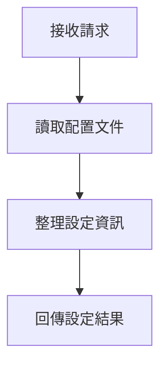

**循序圖**:
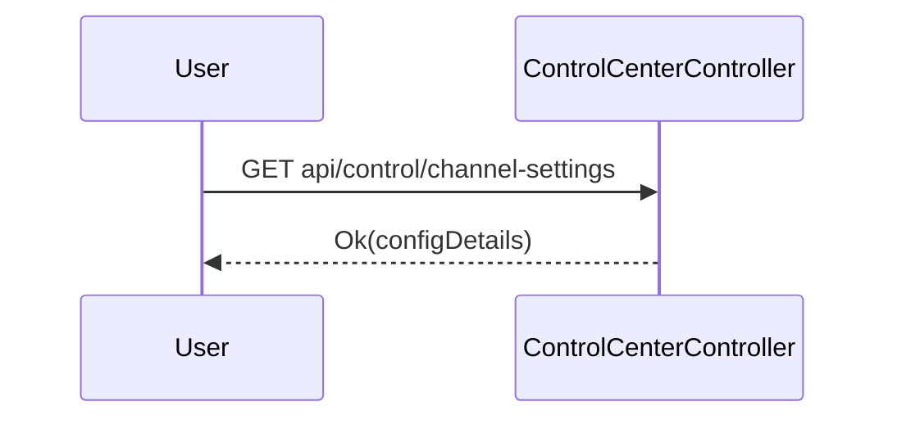

#### 3.1.5 POST `channel-settings`
儲存新的頻道配置。

**流程圖**:
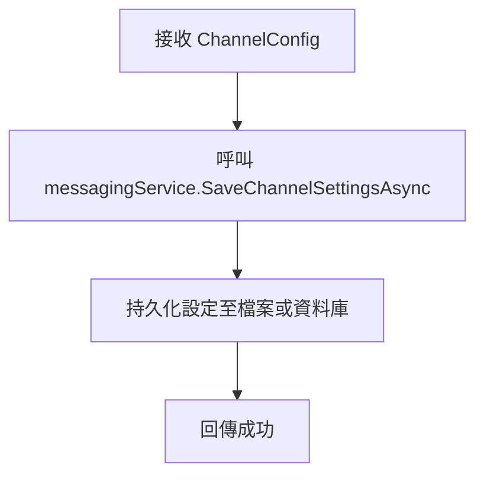

**循序圖**:
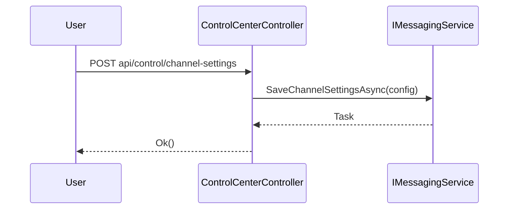

#### 3.1.6 POST `channel-settings/verify-webhook`
驗證指定的頻道 Webhook 是否運作正常。

**流程圖**:
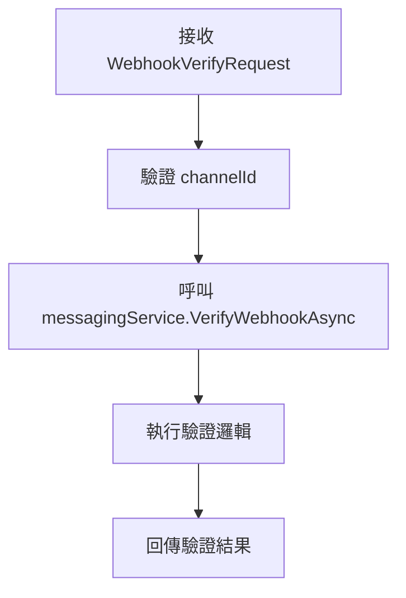

**循序圖**:
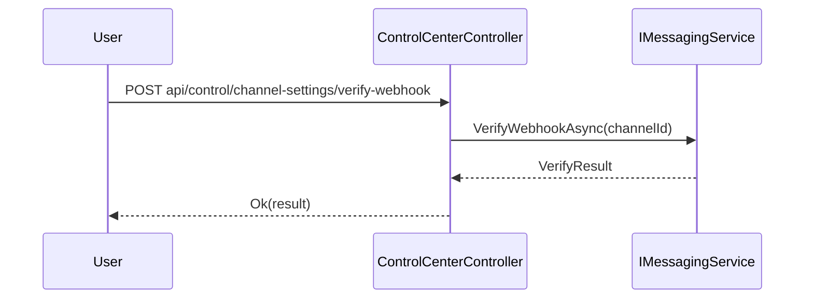

### 3.2 HistoryController (`api/history`)
提供訊息歷史記錄的進階查詢功能。

#### 3.2.1 GET `logs`
根據多種條件篩選訊息記錄並支援分頁。

**流程圖**:
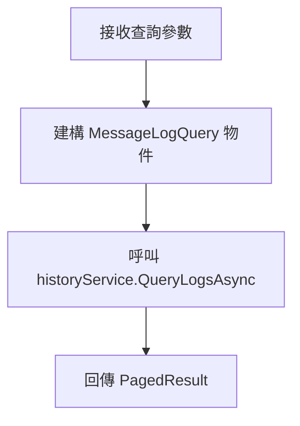

**循序圖**:
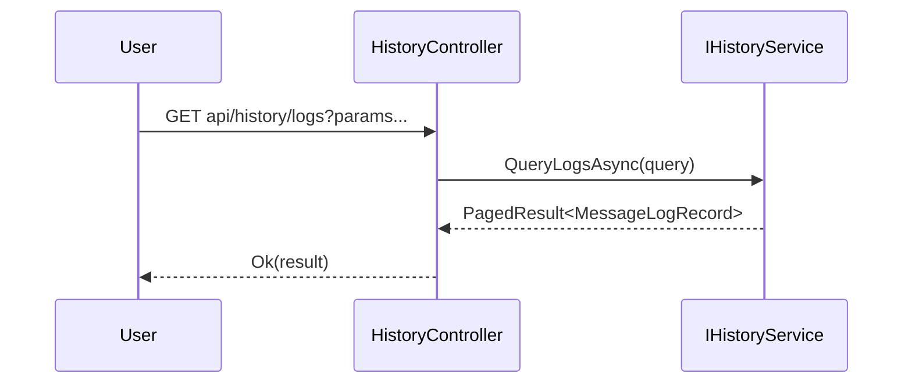

### 3.3 TelegramWebhookController (`api/telegram`)
接收來自 Telegram 的 Webhook 通知。

#### 3.3.1 POST `webhook`
處理 Telegram 訊息。

**流程圖**:
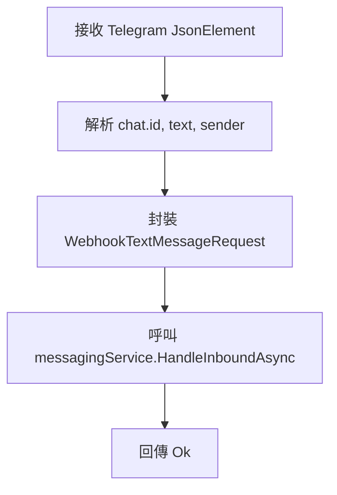

**循序圖**:
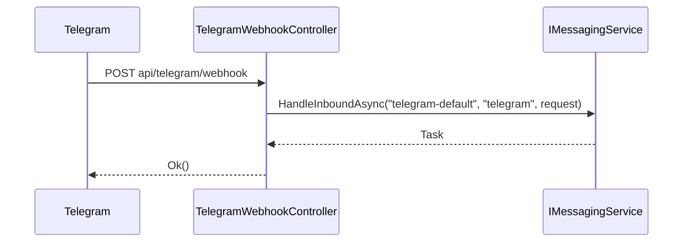

### 3.4 LineWebhookController (`api/line`)
接收來自 LINE 的 Webhook 通知。

#### 3.4.1 POST `webhook`
處理 LINE 訊息。

**流程圖**:
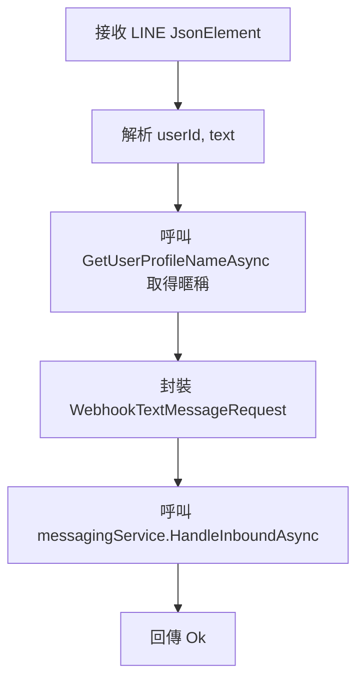

**循序圖**:
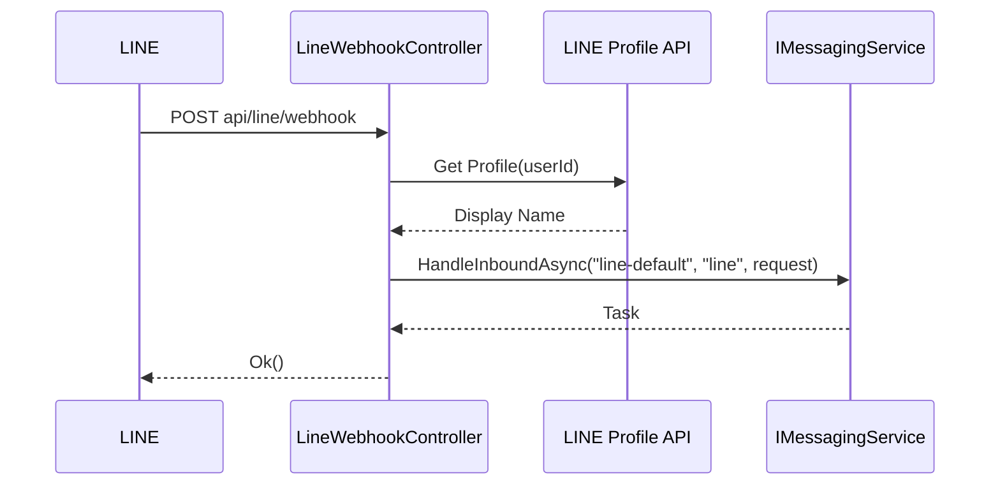

### 3.5 WebhooksController (`api/webhooks/{channel}/{tenantId}`)
通用的 Webhook 進入點，供其他第三方系統呼叫。

#### 3.5.1 POST `text`
接收純文字 Webhook 請求。

**流程圖**:
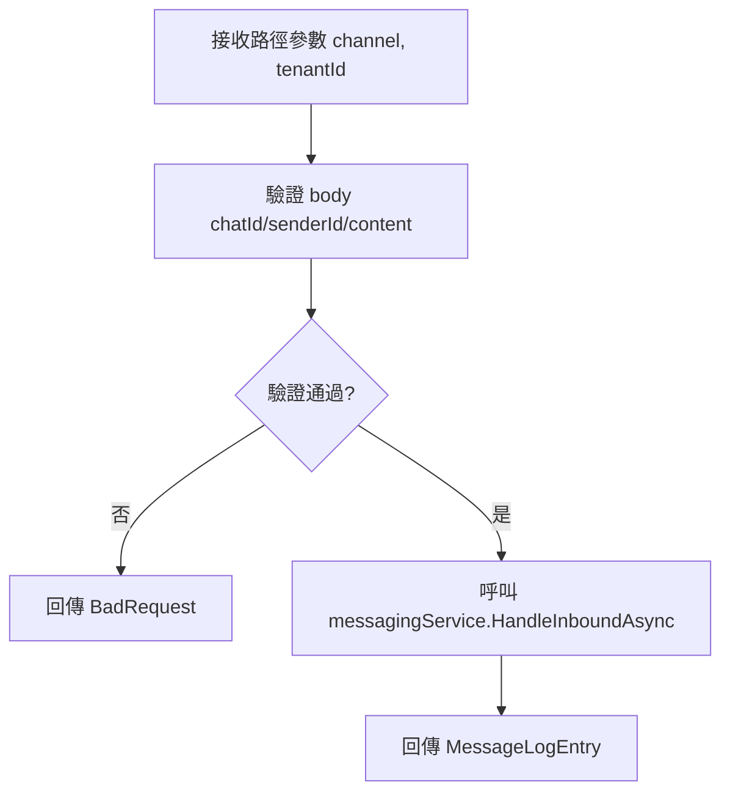

**循序圖**:
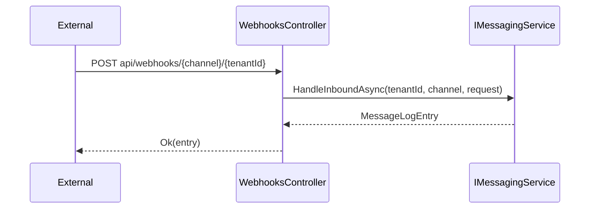

## 4. 訊息發送機制與元件交互

### 4.1 呼叫鏈 (Call Chain)
當訊息需要發送出站（Outbound）或接收進站（Inbound）時，會經過以下呼叫鏈：

1.  **Controller**: 接收外部請求。
2.  **IMessagingService**: 業務邏輯進入點，決定訊息流向。
3.  **IMessageCoordinator**: 協調訊息的分發與處理路徑。
4.  **IMessageBus**: 負責將訊息放入非同步佇列。
5.  **ChannelManager (BackgroundService)**: 持續監聽 MessageBus，消費訊息並透過 `IChannel` 實際發送。

### 4.2 非同步解耦機制
API 層透過 `IMessageBus` 與後端處理邏輯解耦。

**交互循序圖**:
```mermaid
sequenceDiagram
    participant Controller
    participant Service as IMessagingService
    participant Bus as IMessageBus
    participant Worker as ChannelManager (Worker)
    participant Channel as IChannel (LINE/Telegram)

    Note over Controller, Bus: API 要求處理流程
    Controller->>Service: SendManualAsync / HandleInboundAsync
    Service->>Bus: PublishOutboundAsync(message)
    Bus-->>Service: 成功放入佇列
    Service-->>Controller: 回傳 (不等待實際發送結果)
    
    Note over Worker, Channel: 背景非同步發送流程
    loop 每隔一段時間或有新訊息時
        Worker->>Bus: ConsumeOutboundAsync()
        Bus-->>Worker: 取得待發送訊息
        Worker->>Channel: SendAsync(message)
        Channel-->>Worker: 發送結果
        Worker->>Worker: 處理重試或記錄結果
    end
```

此機制確保了：
- **高回應性**: API 不需要等待第三方平台（如 LINE API）的回應即可回傳給客戶端。
- **容錯與重試**: 若第三方平台暫時失效，Worker 層可以根據重試策略重新嘗試。
- **負載平衡**: 透過訊息佇列，可以平滑流量尖峰。
