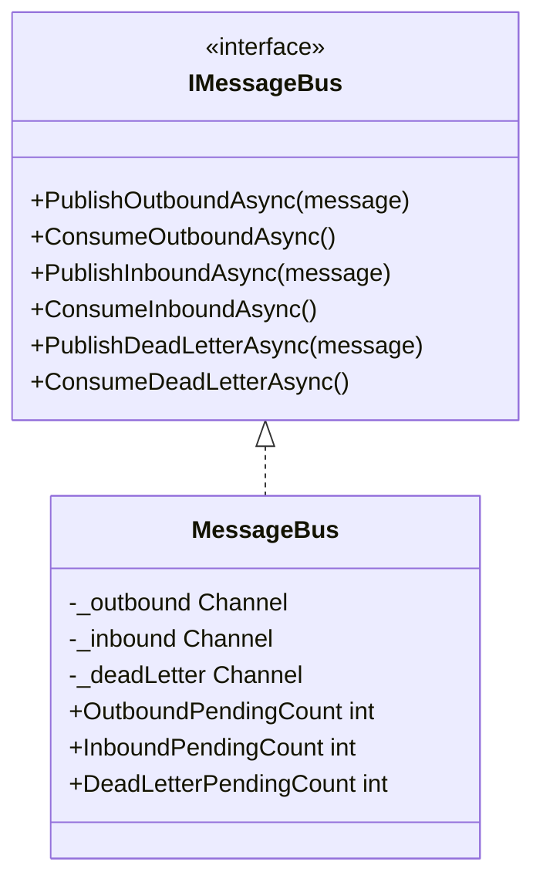
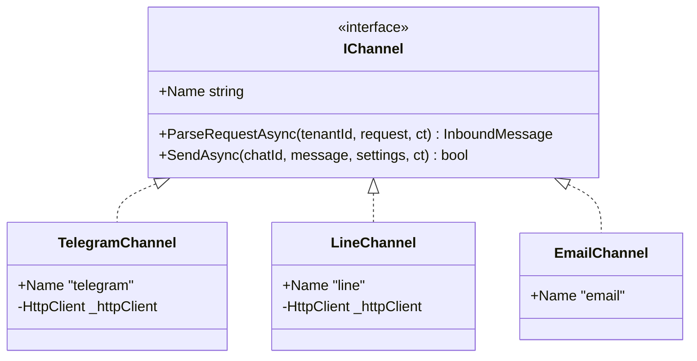
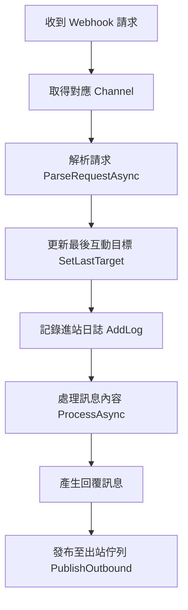
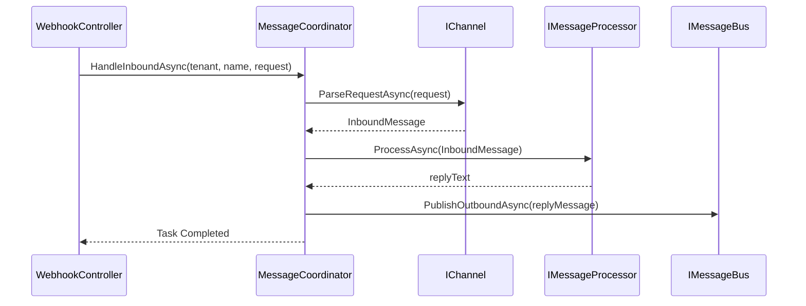
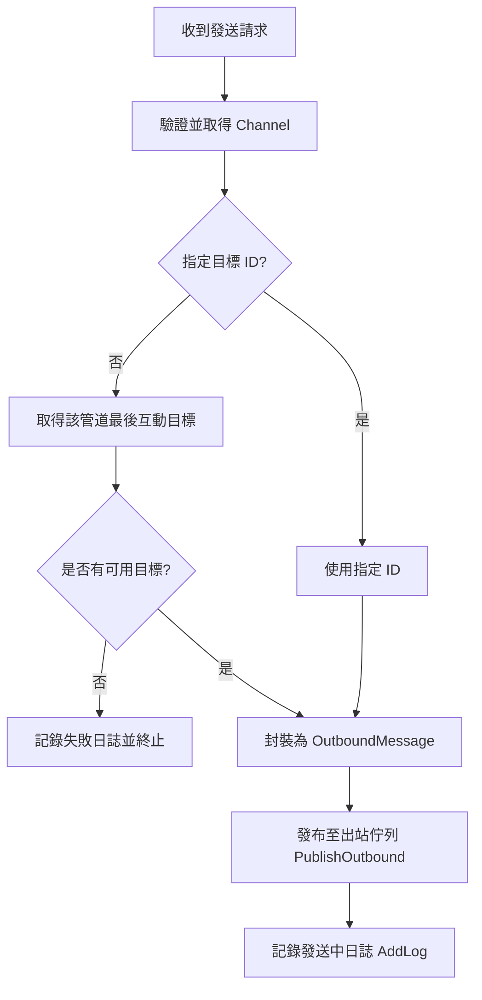
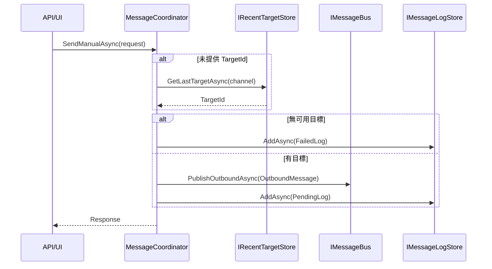

> 此文件由程式碼自動分析產生，最後更新：2026-03-24

# MessageHub.Core 專案架構與運作機制

MessageHub.Core 是整個系統的核心邏輯層，負責定義通訊協定、處理訊息佇列以及協調不同通訊管道（Channel）之間的互動。

## 1. 專案概述
在 Clean Architecture 架構中，MessageHub.Core 扮演 **Core/Domain 層** 的角色。它定義了所有外部基礎設施（Infrastructure）必須遵守的介面，並實作了不依賴於特定外部技術（如資料庫或特定 API SDK）的核心業務邏輯。

其主要職責包括：
* 定義訊息與管道的資料模型。
* 管理內部訊息交換佇列。
* 協調整合不同通訊管道的推播與接收流程。
* 提供基礎的訊息處理邏輯（如 Echo 回應）。

## 2. 核心介面清單與說明

| 介面 | 說明 | 主要方法 / 屬性 |
| :--- | :--- | :--- |
| **IChannel** | 定義通訊管道的基礎行為。 | `Name`, `ParseRequestAsync`, `SendAsync` |
| **IMessageBus** | 提供異步訊息交換的發行與訂閱機制。 | `PublishOutboundAsync`, `ConsumeOutboundAsync` 等 |
| **IMessageCoordinator** | 系統的門面，協調進站與出站訊息流。 | `HandleInboundAsync`, `SendManualAsync` |
| **IMessageProcessor** | 定義如何處理接收到的訊息並產生回覆。 | `ProcessAsync` |
| **IRetryPipeline** | 封裝重試邏輯，提升系統韌性。 | `ExecuteAsync` |
| **IChannelSettingsService** | 管理管道的設定檔（讀取與儲存）。 | `GetAsync`, `SaveAsync`, `GetSettingsFilePath` |
| **IMessageLogStore** | 負責訊息日誌的持久化存取。 | `AddAsync`, `GetRecentAsync` |
| **IRecentTargetStore** | 紀錄各管道最後互動的目標對象。 | `SetLastTargetAsync`, `GetLastTargetAsync` |

## 3. 資料模型完整列表

### 訊息相關 (Messages)
* **InboundMessage**: 接收自外部管道的訊息內容。包含 `TenantId`, `ChannelName`, `SenderId`, `Content`, `RawData`。
* **OutboundMessage**: 準備發送到外部管道的訊息。包含 `Id`, `ChannelName`, `TargetId`, `Content`, `Metadata`。
* **DeadLetterMessage**: 處理失敗且無法重試的死信訊息。包含 `OriginalMessage`, `ErrorReason`, `Timestamp`。
* **MessageLogEntry**: 用於日誌記錄的訊息快照。包含 `MessageId`, `Direction`, `Channel`, `Content`, `Timestamp`, `Status`。

### 設定相關 (Settings & Definitions)
* **ChannelConfig**: 包含管道啟用狀態與具體設定。欄位：`IsEnabled`, `Settings` (Dictionary)。
* **ChannelSettings**: 整體管道配置容器。欄位：`Channels` (Dictionary<string, ChannelConfig>)。
* **ChannelDefinition**: 管道的描述資訊。欄位：`Name`, `Fields` (List)。
* **ChannelTypeDefinition**: 管道類型定義，用於 UI 生成。欄位：`Type`, `DisplayName`。
* **ChannelConfigFieldDefinition**: 管道設定欄位的屬性。欄位：`Key`, `Label`, `Type`, `IsRequired`。

### 請求與結果 (Requests & Results)
* **SendMessageRequest**: 手動發送訊息的請求。欄位：`ChannelName`, `Content`, `TargetId` (選填)。
* **WebhookTextMessageRequest**: 接收 Webhook 文字訊息的標準格式。欄位：`Text`, `From`。
* **WebhookVerifyRequest**: Webhook 驗證請求。欄位：`Token`, `Challenge`。
* **WebhookVerifyResult**: Webhook 驗證結果。欄位：`Success`, `Response`。
* **RecentTargetInfo**: 記錄最後互動目標。欄位：`TargetId`, `DisplayName`, `LastSeen`。

### 列舉值 (Enums)
* **DeliveryStatus**: 遞送狀態。值：`Pending`, `Sent`, `Failed`, `Received`。
* **MessageDirection**: 訊息流向。值：`Inbound`, `Outbound`。

## 4. MessageBus 佇列架構

MessageBus 內部使用 `System.Threading.Channels` 實作，配置為 `UnboundedChannelOptions` 且 `SingleReader/Writer` 皆為 `false`。



## 5. Channel 系統

Channel 系統採用介面隔離，確保系統可以輕鬆擴充新的通訊方式。



* **TelegramChannel**: 使用 Telegram Bot API，透過 `BotToken` 進行驗證並調用 `sendMessage` 介面。
* **LineChannel**: 使用 LINE Messaging API，透過 `ChannelAccessToken` 與 Bearer Auth 進行推播。
* **EmailChannel**: 目前為 POC 階段，`SendAsync` 為空實作。

## 6. ChannelFactory 工廠模式
`ChannelFactory` 在建構時注入所有 `IEnumerable<IChannel>`，並建立一個不區分大小寫的字典。
* `GetChannel(name)`: 根據名稱取得對應實例，若找不到則拋出 `KeyNotFoundException`。
* `GetDefinitions()`: 遍歷所有管道並回傳其結構定義，供前端動態產生設定介面。

## 7. ChannelSettingsResolver 模糊匹配策略
當從字典中尋找特定管道的設定時，Resolver 依序執行以下六種策略，直到匹配成功：

1. **直接匹配 (Direct)**: 使用原始 Key 直接從字典讀取。
2. **不區分大小寫全名 (Case-Insensitive)**: 忽略大小寫搜尋相符的 Key。
3. **前綴匹配 (Prefix)**: 檢查 Key 是否以 `channel_` 開頭（例如 `channel_telegram`）。
4. **後綴匹配 (Suffix)**: 檢查 Key 是否以 `_channel` 結尾（例如 `telegram_channel`）。
5. **包含匹配 (Contains)**: 檢查 Key 是否包含管道名稱。
6. **特徵推論 (Feature Inference)**: 檢查 Key 的名稱是否具備該管道特有的設定欄位特徵。

## 8. MessageCoordinator 訊息協調器

### HandleInboundAsync (處理進站訊息)

當 Webhook 接收到訊息時，由此流程處理。

#### 流程圖


#### 循序圖


### SendManualAsync (手動發送訊息)

由使用者或系統主動觸發的發送流程。

#### 流程圖


#### 循序圖


## 9. EchoMessageProcessor
這是 `IMessageProcessor` 的預設實作。其邏輯非常簡單：接收到 `InboundMessage` 後，在內容前面加上 `[ECHO] ` 字樣並回傳。這用於驗證端到端通訊是否正常運作。

## 10. DI 註冊
核心層的組件透過 `AddMessageHubCore` 擴充方法進行註冊，通常皆採用 `Singleton` 生命週期以維持佇列與工廠的狀態。

```csharp
services.AddSingleton<IChannel, TelegramChannel>();
services.AddSingleton<IChannel, LineChannel>();
services.AddSingleton<IChannel, EmailChannel>();
services.AddSingleton<ChannelFactory>();
services.AddSingleton<MessageBus>();
services.AddSingleton<IMessageBus>(sp => sp.GetRequiredService<MessageBus>());
services.AddSingleton<IMessageProcessor, EchoMessageProcessor>();
services.AddSingleton<IMessageCoordinator, MessageCoordinator>();
```