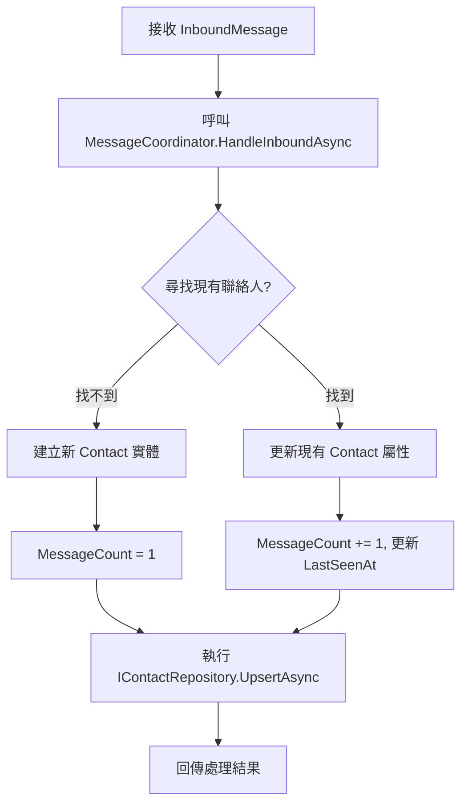
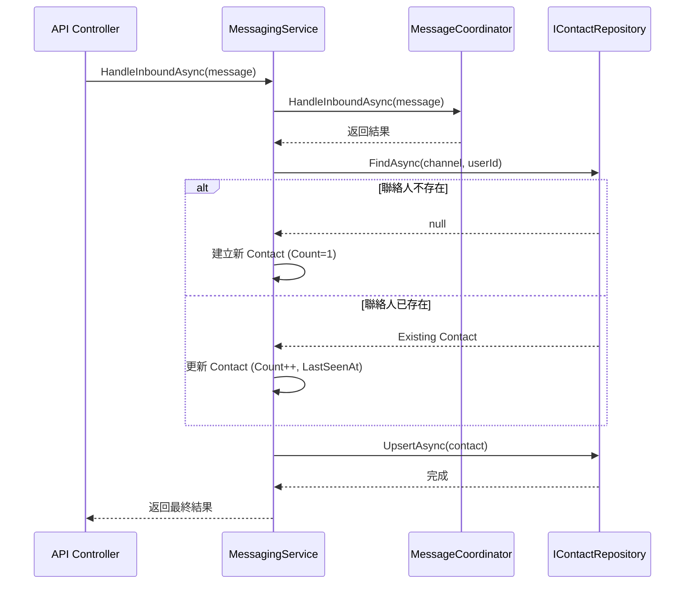
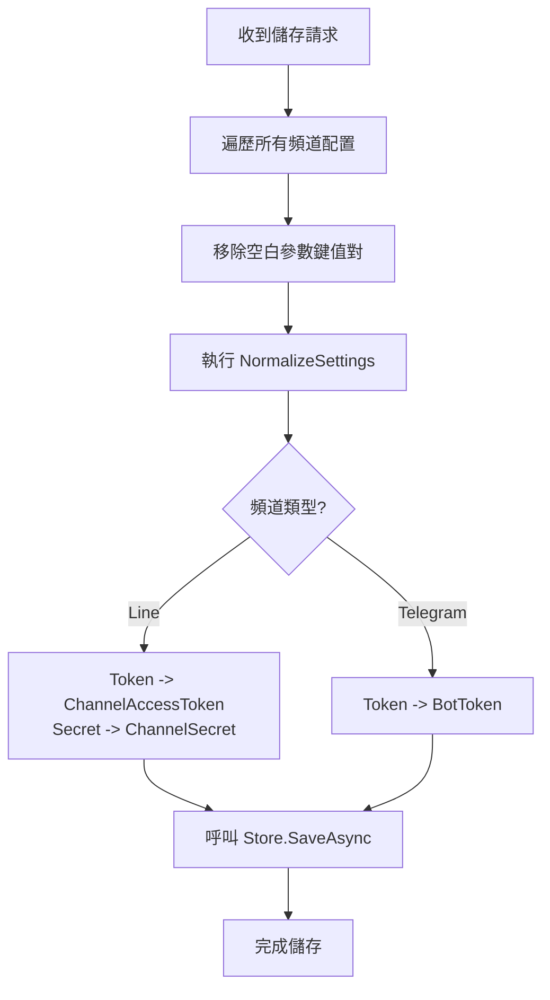
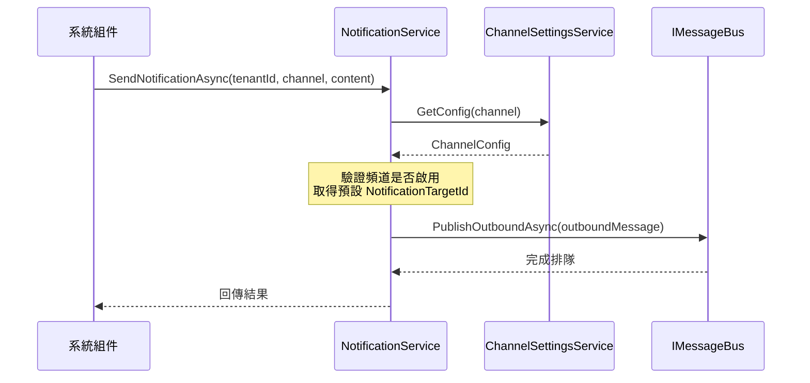
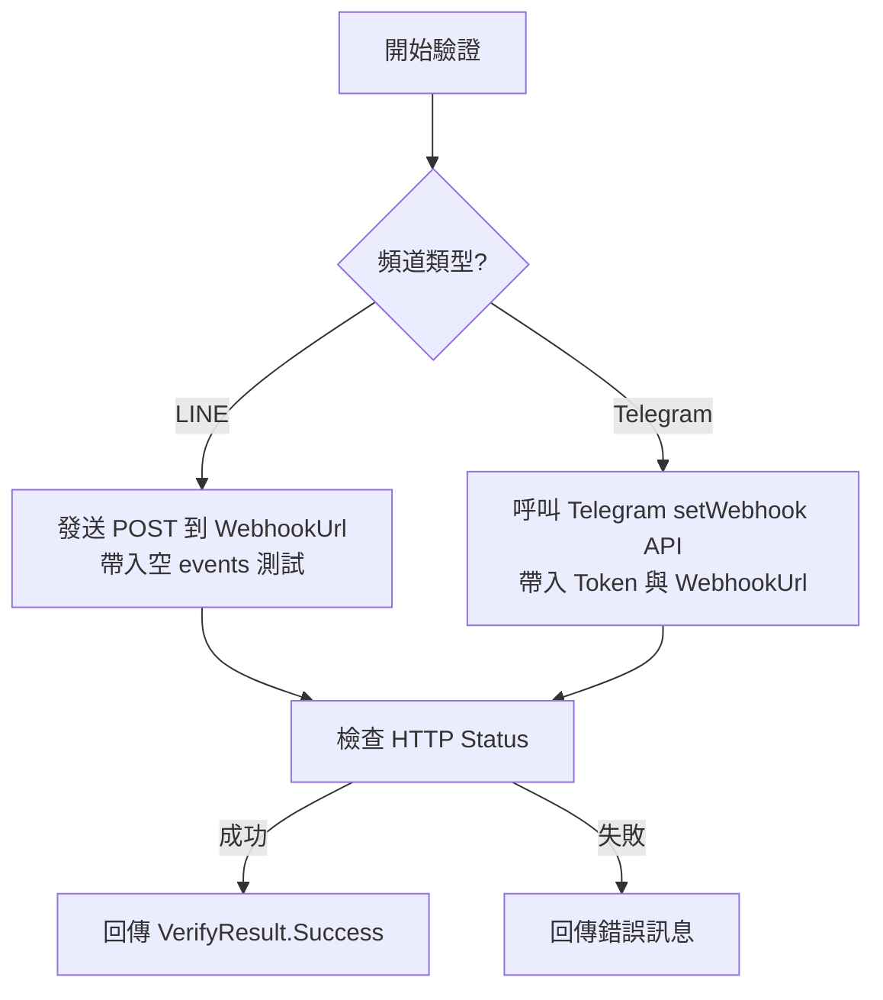

> 此文件由程式碼自動分析產生，最後更新：2026-03-24

# MessageHub.Domain 專案架構與運作機制

## 1. 專案概述

`MessageHub.Domain` 在 Clean Architecture 中擔任核心 Domain 層的角色。它定義了系統的核心業務邏輯、實體模型、儲存介面以及跨層級的通訊協定。此層級不依賴於外部框架或資料庫實作，確保業務邏輯的純粹性與可測試性。

### 主要職責
- 定義跨平台的通訊模型與聯絡人資料結構。
- 提供訊息處理、歷史記錄、聯絡人管理與頻道設定的介面。
- 實作整合性服務（Facade），協調 Core 層的通訊功能與 Domain 層的資料持久化。
- 管理訊息通知與 Webhook 驗證流程。

## 2. Domain 介面定義

系統透過以下介面定義各項核心服務的契約：

| 介面 | 描述 |
| :--- | :--- |
| `IMessagingService` | 網域門面介面，API 層存取通訊功能的唯一入口，封裝了訊息傳送、接收與設定。 |
| `IHistoryService` | 訊息歷史記錄查詢服務，提供分頁與過濾功能的唯讀介面。 |
| `IContactService` | 聯絡人管理服務，負責聯絡人的 CRUD 操作。 |
| `INotificationService` | 系統主動通知服務，用於發送自動化通知（如系統警報、狀態更新）。 |
| `IWebhookVerificationService` | 提供各頻道（如 LINE, Telegram）Webhook 設定的驗證邏輯。 |
| `IChannelSettingsService` | 頻道參數配置服務，管理各通訊平台的 API 金鑰與運作參數。 |
| `IChannelSettingsStore` | 設定持久化存取介面，通常對應到 JSON 檔案或資料庫儲存。 |
| `ICommonParameterProvider` | 提供全域通用的參數配置（如預設通知對象）。 |

## 3. Domain 模型

### Contact (聯絡人)
記錄曾在各個頻道與系統互動的使用者。
- `Id`: 系統唯一識別碼。
- `Channel`: 來源頻道（Line, Telegram 等）。
- `PlatformUserId`: 平台原始使用者 ID。
- `DisplayName`: 顯示名稱（可能由 Webhook 事件取得）。
- `ChatId`: 特定頻道下的對話群組 ID。
- `FirstSeenAt` / `LastSeenAt`: 首次與最後互動時間。
- `MessageCount`: 累計互動訊息數量。

### MessageLog (訊息日誌)
- `MessageLogQuery`: 包含頻道、方向、狀態、目標、關鍵字與時間範圍的查詢參數。
- `MessageLogRecord`: 代表單筆訊息的完整記錄，包含時間戳記、來源、內容與詳細原始資料（Details）。
- `PagedResult<T>`: 標準化分頁結果封裝，提供總筆數、當前頁碼、總頁數以及是否具備前/後一頁的計算邏輯。

## 4. Repository 介面

Domain 層定義儲存介面，具體實作由 Data 層提供：

### IContactRepository
- `UpsertAsync(Contact)`: 新增或更新聯絡人資訊。
- `FindAsync(Channel, PlatformUserId)`: 根據頻道與平台 ID 尋找聯絡人。
- `GetAllAsync()`: 取得所有聯絡人列表。

### IMessageLogRepository
- `AddAsync(MessageLogRecord)`: 寫入訊息日誌。
- `QueryAsync(MessageLogQuery)`: 執行複雜的條件篩選並回傳分頁結果。
- `GetRecentAsync(int count)`: 快速取得最近的訊息列表。

## 5. 服務實作詳解

### MessagingService (門面服務)
`MessagingService` 是系統的核心進入點，採用門面模式（Facade Pattern）封裝了訊息協調器、頻道設定與驗證邏輯。

#### 主要邏輯：HandleInboundAsync
當系統接收到外部訊息（Inbound）時，此服務負責兩大任務：
1. 調用 `IMessageCoordinator` 處理訊息核心邏輯。
2. 自動維護 `Contact`（聯絡人）資訊，實現 Upsert 邏輯。

**聯絡人更新邏輯：**
- 檢查資料庫是否已存在該頻道的使用者（`PlatformUserId`）。
- 若不存在：建立新聯絡人，設定 `FirstSeenAt`、`DisplayName`、`ChatId`。
- 若已存在：更新 `LastSeenAt`、`DisplayName`、`ChatId`，並將 `MessageCount` 加 1。

#### 流程圖 (HandleInboundAsync)


#### 循序圖 (HandleInboundAsync)


### HistoryService (日誌查詢)
簡單的委派服務，將 `IMessageLogRepository` 的進階查詢功能（`QueryAsync`, `GetRecentAsync`）暴露給應用層。

### ContactService (聯絡人管理)
提供標準的聯絡人 CRUD 操作，直接委派給 `IContactRepository`。

### ChannelSettingsService (頻道配置)
負責管理各通訊平台的參數，並提供**正規化（Normalization）**功能以確保設定的一致性。

#### 配置正規化邏輯
在儲存設定前，服務會執行以下清理動作：
1. **全域清理**：移除空白鍵名、去除參數值的首尾空格。
2. **舊版相容（Legacy Mapping）**：
   - **LINE**: 將舊版鍵名 `Token` 轉換為 `ChannelAccessToken`；`Secret` 轉換為 `ChannelSecret`。
   - **Telegram**: 將舊版鍵名 `Token` 轉換為 `BotToken`。
3. **欄位定義**：定義 `ChannelTypeDefinition`，包含 Line, Telegram, Email 各自需要的參數欄位（如 `WebhookUrl`, `SmtpHost` 等）。

#### 流程圖 (SaveChannelSettings)


### NotificationService (主動通知)
內部服務，用於系統主動對外發送訊息。它不透過 Webhook，而是直接利用 `ChannelFactory` 建立對應頻道並發送。

#### 循序圖 (SendNotificationAsync)


### WebhookVerificationService (連線驗證)
負責驗證 Webhook 設定是否正確。

#### 流程圖 (VerifyAsync)


## 6. JsonChannelSettingsStore (持久化)

實作 `IChannelSettingsStore`，負責將配置持久化到 JSON 檔案。

### 核心功能
- **預設路徑**：位於 `data/channel-settings.json`。
- **自動修復**：若檔案不存在，會自動建立包含預設值的初始配置。
- **舊格式相容（Fallback）**：
  - 嘗試以現行格式（`Dictionary<string, ChannelConfig>`）反序列化。
  - 若失敗，則嘗試解析舊版陣列格式（`LegacyChannelConfig[]`）並轉換為新格式。

## 7. DI 註冊

在 `DependencyInjection` 中，這些服務通常以 `Singleton` 方式註冊：

```csharp
services.AddSingleton<IChannelSettingsStore, JsonChannelSettingsStore>();
services.AddSingleton<ChannelSettingsService>();
services.AddSingleton<IChannelSettingsService>(sp => sp.GetRequiredService<ChannelSettingsService>());
services.AddSingleton<ICommonParameterProvider>(sp => sp.GetRequiredService<ChannelSettingsService>());
services.AddSingleton<INotificationService, NotificationService>();
services.AddSingleton<IWebhookVerificationService, WebhookVerificationService>();
services.AddSingleton<IMessagingService, MessagingService>();
services.AddSingleton<IHistoryService, HistoryService>();
services.AddSingleton<IContactService, ContactService>();
```

