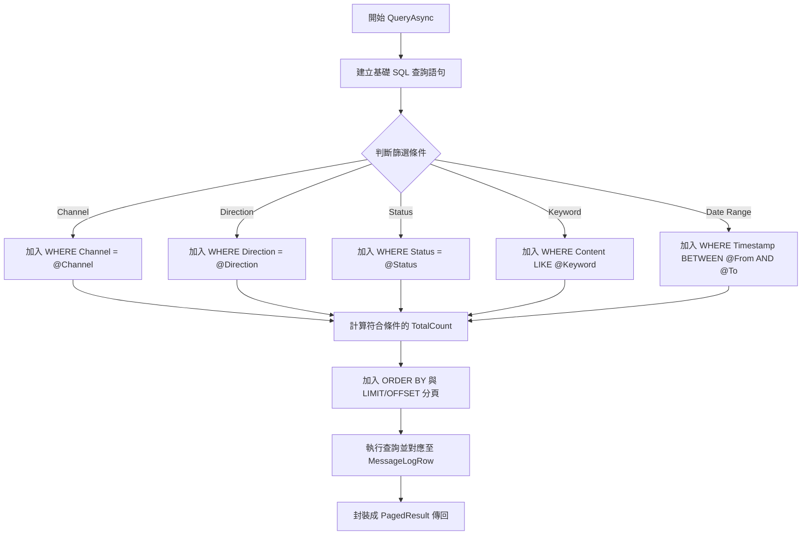
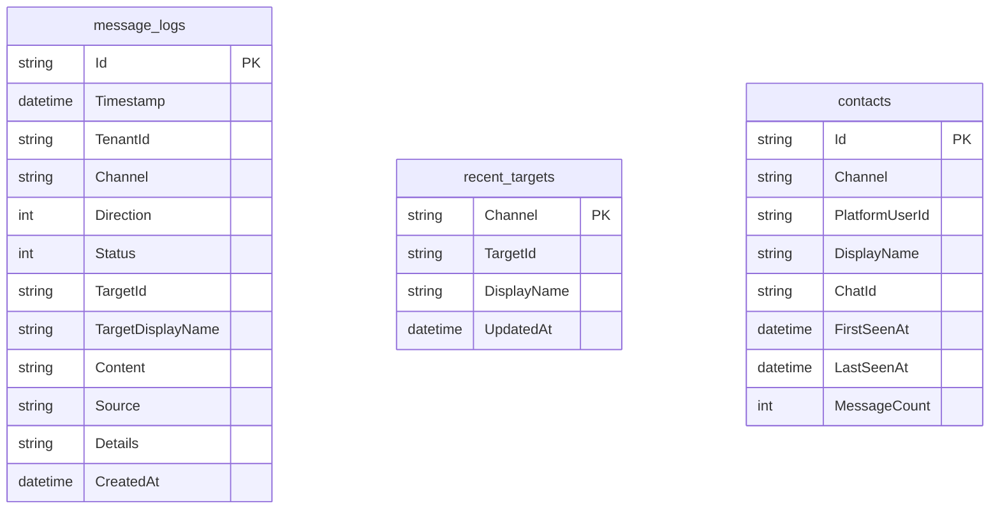
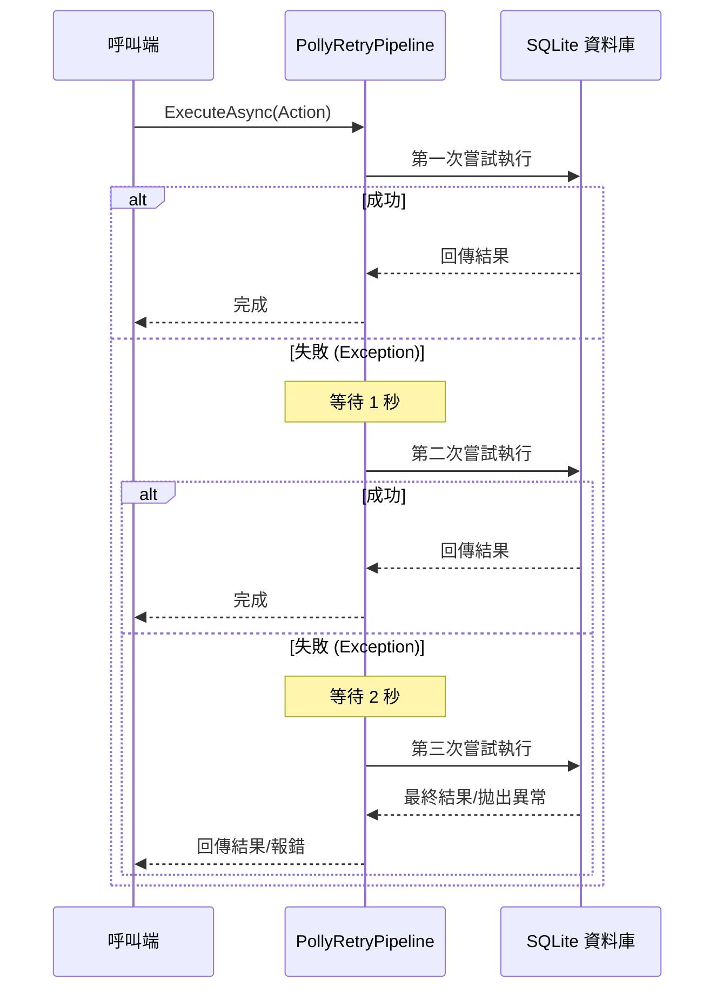

> 此文件由程式碼自動分析產生，最後更新：2026-03-24

# MessageHub.Infrastructure 專案架構文件

MessageHub.Infrastructure 層位於 Clean Architecture 的最外層，負責處理所有與外部系統（如資料庫、第三方套件）的互動。本專案主要實作基於 SQLite 的資料持久化機制，以及透過 Polly 實作的韌性重試策略。

## 1. 專案概述

Infrastructure 層的主要職責是實作 Domain 層與 Core 層定義的介面。透過相依性反轉原則（Dependency Inversion Principle），確保核心業務邏輯不依賴於具體的資料庫技術。

### 核心角色
- **資料持久化**：使用 SQLite 作為輕量級資料庫，存放訊息日誌、最近通訊對象與聯絡人資訊。
- **韌性策略**：實作 Polly 重試機制，確保資料庫操作或外部呼叫在遇到暫時性錯誤時能自動重試。
- **介面實作**：為 `IMessageLogRepository`、`IMessageLogStore`、`IContactRepository` 等介面提供具體實作。

---

## 2. SQLite 持久化架構

### SqliteConnectionFactory
負責建立與管理 SQLite 資料庫連線。
- **設計**：封裝連線字串，並提供 `CreateConnection()` 方法傳回 `SqliteConnection` 執行個體。
- **連線管理**：由呼叫端（Repository）負責開啟與關閉連線（通常配合 Dapper 使用）。

### DatabaseInitializer
負責在應用程式啟動時確保資料庫架構正確。

#### 完整 DDL 語句
```sql
-- 訊息日誌表
CREATE TABLE IF NOT EXISTS message_logs (
    Id TEXT PRIMARY KEY,
    Timestamp DATETIME NOT NULL,
    TenantId TEXT,
    Channel TEXT NOT NULL,
    Direction INTEGER NOT NULL,
    Status INTEGER NOT NULL,
    TargetId TEXT,
    TargetDisplayName TEXT,
    Content TEXT,
    Source TEXT,
    Details TEXT,
    CreatedAt DATETIME NOT NULL
);

-- 訊息日誌索引
CREATE INDEX IF NOT EXISTS idx_message_logs_timestamp ON message_logs (Timestamp DESC);
CREATE INDEX IF NOT EXISTS idx_message_logs_channel ON message_logs (Channel);
CREATE INDEX IF NOT EXISTS idx_message_logs_target ON message_logs (TargetId);
CREATE INDEX IF NOT EXISTS idx_message_logs_direction ON message_logs (Direction);
CREATE INDEX IF NOT EXISTS idx_message_logs_status ON message_logs (Status);

-- 最近通訊對象表
CREATE TABLE IF NOT EXISTS recent_targets (
    Channel TEXT PRIMARY KEY,
    TargetId TEXT NOT NULL,
    DisplayName TEXT,
    UpdatedAt DATETIME NOT NULL
);

-- 聯絡人表
CREATE TABLE IF NOT EXISTS contacts (
    Id TEXT PRIMARY KEY,
    Channel TEXT NOT NULL,
    PlatformUserId TEXT NOT NULL,
    DisplayName TEXT,
    ChatId TEXT,
    FirstSeenAt DATETIME NOT NULL,
    LastSeenAt DATETIME NOT NULL,
    MessageCount INTEGER DEFAULT 0,
    UNIQUE(Channel, PlatformUserId)
);

-- 聯絡人索引
CREATE INDEX IF NOT EXISTS idx_contacts_channel ON contacts (Channel);
CREATE INDEX IF NOT EXISTS idx_contacts_last_seen ON contacts (LastSeenAt DESC);
```

### SqliteMessageLogRepository
此類別同時實作了兩個不同層級的介面，是一個特殊的設計：
- **IMessageLogStore (Core)**：提供給基礎架構或監控功能使用的低階讀取操作。
- **IMessageLogRepository (Domain)**：提供給業務邏輯使用的領域模型操作。

**設計原因**：
1. **資料來源一致性**：無論是業務邏輯還是系統查詢，資料來源皆為同一張 `message_logs` 表。
2. **減少冗餘代碼**：兩者共用相似的 SQL 查詢邏輯與 DTO 映射。
3. **介面隔離**：雖然實作在同一個類別，但對外仍透過不同的介面暴露功能，維持 Clean Architecture 的層級關係。

#### QueryAsync 動態 SQL 流程


### SqliteRecentTargetStore
實作 `IRecentTargetStore`，管理每個通道最後一次互動的對象。
- **UPSERT 模式**：使用 `INSERT INTO recent_targets ... ON CONFLICT(Channel) DO UPDATE` 確保資料唯一性並即時更新時間。

### SqliteContactRepository
實作 `IContactRepository`，負責維護跨通道的聯絡人資訊。
- **UPSERT 邏輯**：當聯絡人訊息進入時，若聯絡人已存在則更新 `LastSeenAt`、`MessageCount` 與 `DisplayName`（使用 `COALESCE` 保留舊名稱或更新新名稱）。

---

## 3. 資料庫 Schema ER 圖



---

## 4. PollyRetryPipeline 韌性重試

專案使用 Polly 套件建立重試管線，以應對資料庫鎖定（Database is locked）等暫時性錯誤。

### 重試策略
- **最大嘗試次數**：3 次。
- **延遲時間**：1秒 -> 2秒 -> 4秒（指數退避）。
- **處理類型**：擷取所有 `Exception` 並觸發重試。

### 重試流程循序圖


---

## 5. DI 註冊與初始化

### 相依性注入註冊
在 `IServiceCollection` 中註冊 Infrastructure 相關服務：
```csharp
services.AddSingleton<IRetryPipeline, PollyRetryPipeline>();

// 設定資料庫路徑
var dbPath = Path.Combine("data", "messagehub.db");
Directory.CreateDirectory(Path.GetDirectoryName(dbPath)!);
services.AddSingleton(new SqliteConnectionFactory($"Data Source={dbPath}"));

// 註冊 Repository
services.AddSingleton<SqliteMessageLogRepository>();
// 同一執行個體映射至不同介面
services.AddSingleton<IMessageLogStore>(sp => sp.GetRequiredService<SqliteMessageLogRepository>());
services.AddSingleton<IMessageLogRepository>(sp => sp.GetRequiredService<SqliteMessageLogRepository>());

services.AddSingleton<IRecentTargetStore, SqliteRecentTargetStore>();
services.AddSingleton<IContactRepository, SqliteContactRepository>();
```

### InitializeDatabaseAsync 擴充方法
提供 `IServiceProvider` 的擴充方法，簡化啟動流程中的資料庫初始化：
```csharp
public static async Task InitializeDatabaseAsync(this IServiceProvider services)
{
    using var scope = services.CreateScope();
    var initializer = scope.ServiceProvider.GetRequiredService<DatabaseInitializer>();
    await initializer.InitializeAsync();
}
```
