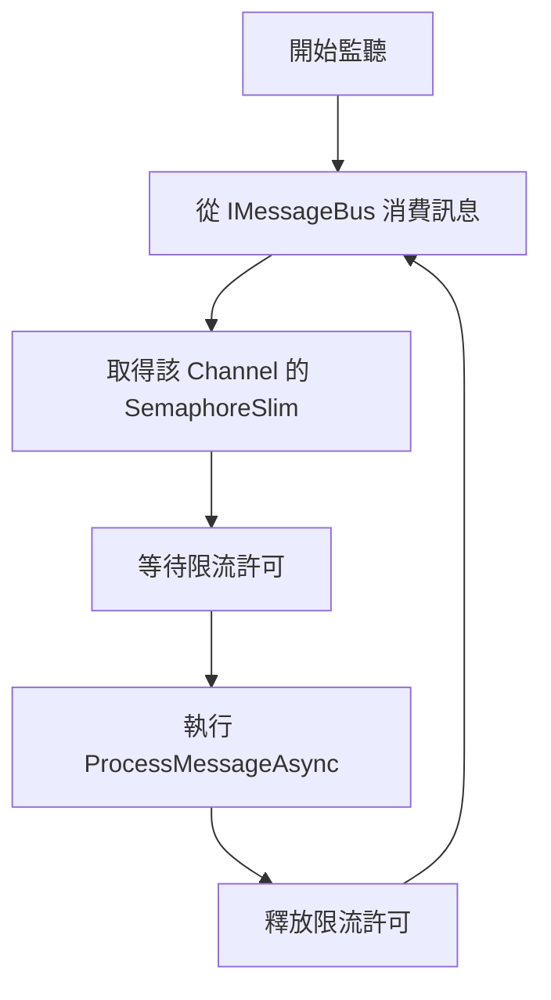
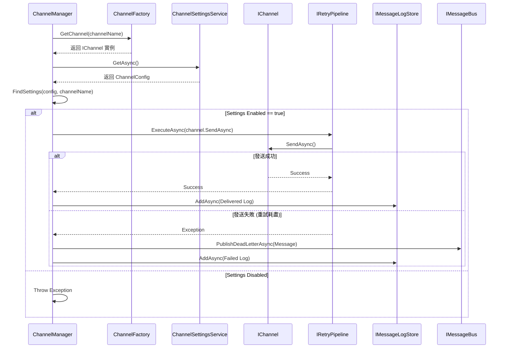
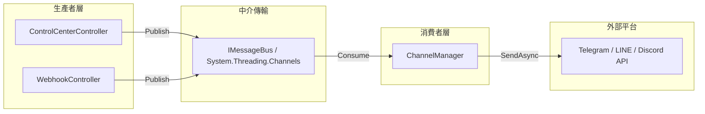

> 此文件由程式碼自動分析產生，最後更新：2026-03-24

# MessageHub.Worker 專案文件

## 1. 專案概述
MessageHub.Worker 在 Clean Architecture 中擔任「應用程式層 (Application Layer)」的背景處理器角色。它負責將來自控制器或其他生產者的訊息請求，非同步地發送至外部通訊平台。

透過實作 `BackgroundService`，Worker 層能獨立於 HTTP 請求生命週期運作，達成系統解耦並提升反應速度。其核心職責包含訊息消費、流量控制、重試補償以及死信隊列處理。

---

## 2. ChannelManager 運作機制

`ChannelManager` 是內部密封類別 (internal sealed class)，這確保了核心處理邏輯被封裝在 Worker 專案內，不會被外部元件直接依賴或修改。

### 2.1 生命週期與 ExecuteAsync 消費迴圈
`ChannelManager` 繼承自 `BackgroundService`。當應用程式啟動時，它會開啟一個長駐的消費迴圈，透過 `IMessageBus` 持續監聽待發送訊息。

#### ExecuteAsync 處理流程


### 2.2 ProcessMessageAsync 處理邏輯
此方法負責訊息發送的具體流程，包含組件尋找、設定驗證、重試執行與結果記錄。

#### 處理序圖


### 2.3 Per-Channel 限流機制
為了避免單一頻道發送頻率過高導致觸發外部 API 的限制，`ChannelManager` 內部維護了一個 `ConcurrentDictionary<string, SemaphoreSlim>`。
*   **機制**：每個頻道對應一個獨立的 `SemaphoreSlim(1, 1)`。
*   **效果**：確保同一時間內，同一個頻道的訊息發送是序列化的，防止併發請求過載。

### 2.4 重試與死信隊列 (DLQ)
*   **重試**：使用 `IRetryPipeline` 封裝發送過程。若 API 暫時不可用，會根據預設策略進行重試。
*   **DLQ**：當重試失敗或發生致命錯誤時，訊息會被轉換為 `DeadLetterMessage` 並推送到死信隊列，供後續人工介入或自動化修正。

---

## 3. Controller 與 BackgroundService 交互機制

本系統採用「發後即忘」(Fire-and-Forget) 模式實現高度解耦。生產者與消費者之間不直接溝通，而是透過緩衝區交換數據。

### 3.1 系統交互架構圖


### 3.2 System.Threading.Channels 的應用
系統使用 `System.Threading.Channels` 作為生產者與消費者的中介橋樑。
*   **生產者**：`MessageCoordinator` 透過 `PublishOutboundAsync` 將訊息寫入 Channel。此操作為非阻塞，寫入成功後立即返回，不等待實際發送結果。
*   **消費者**：`ChannelManager` 透過 `ConsumeOutboundAsync` 以 `IAsyncEnumerable` 形式拉取訊息。這提供了極高的效能與背壓 (Back-pressure) 管理能力。

---

## 4. 技術細節說明

### 4.1 反射機制應用：ExtractTargetDisplayName
在記錄日誌時，系統需要從 Metadata 中提取目標顯示名稱。
`ExtractTargetDisplayName(object? metadata)` 方法透過反射 (Reflection) 檢查物件。
*   **邏輯**：尋找 `metadata` 型別中名稱為 `TargetDisplayName` 的屬性。
*   **優點**：不強制 Metadata 實作特定介面，增加擴充靈活性。若屬性不存在或物件為空，則回傳 `null`。

### 4.2 DI 註冊
在 `Program.cs` 或 `ServiceCollectionExtensions` 中，Worker 被註冊為託管服務：
```csharp
services.AddHostedService<ChannelManager>();
```
這使得 `ChannelManager` 會隨主程式啟動自動開始運作。

---

## 5. 總結
MessageHub.Worker 透過強大的解耦設計，將繁重的訊息發送邏輯從 API 主流程抽離。結合限流、重試與死信隊列機制，確保了訊息發送的高可靠性與可維護性。
