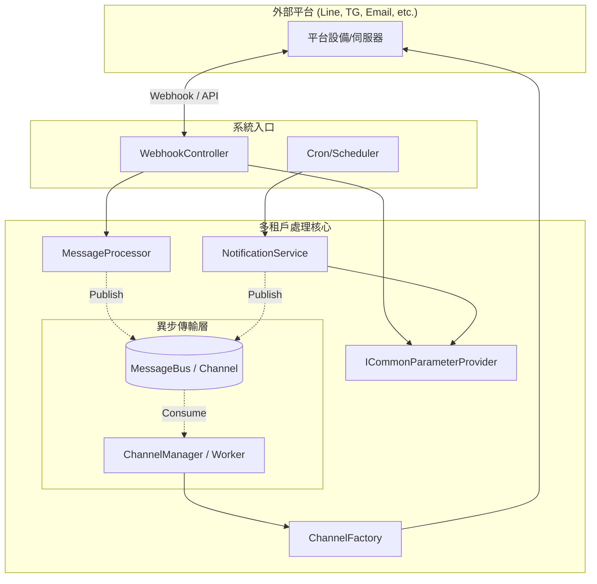
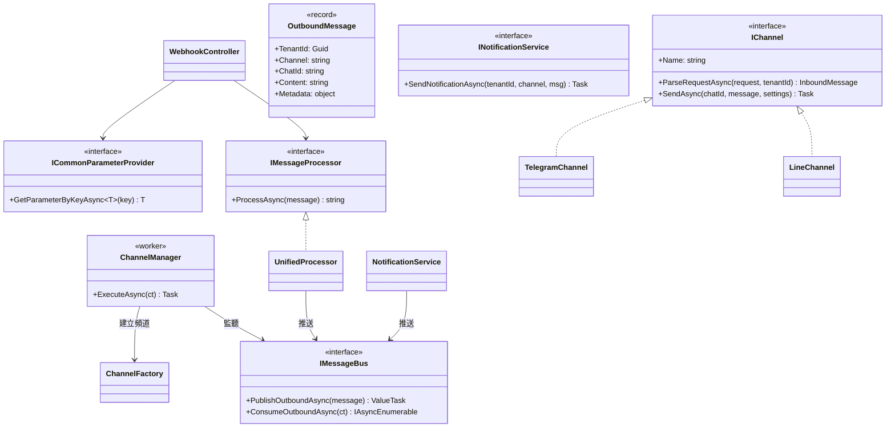
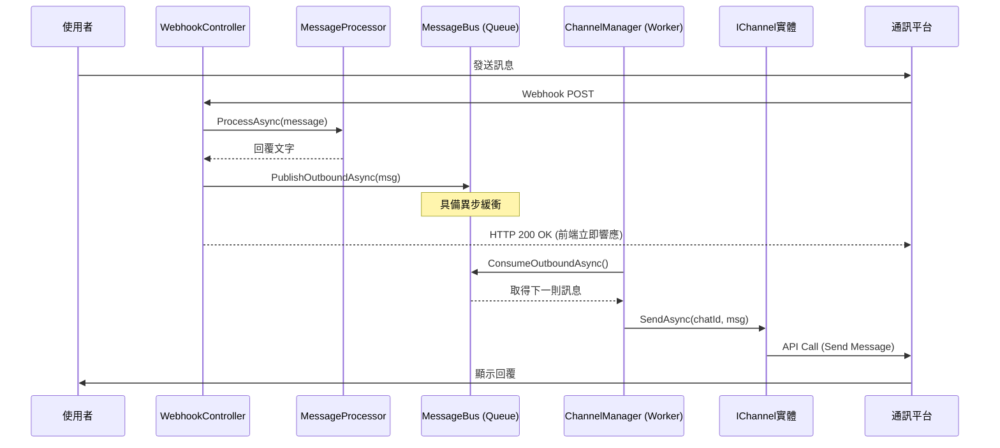
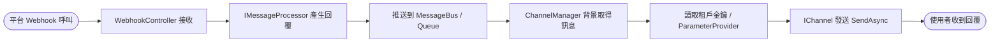
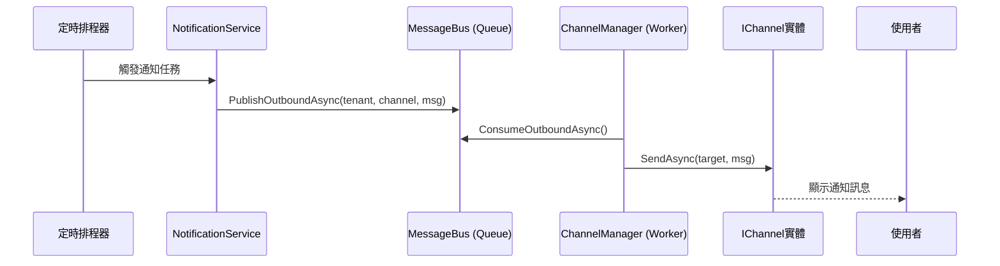

# 聊天頻道系統規格書 (C# 多租戶版本)

> 本文件描述基於 .NET 8/9 的多租戶聊天頻道子系統設計。  
> 支援 Line, Telegram, Email, Slack, FTP, SFTP 等多種頻道，具備處理使用者訊息與系統主動通知之能力。

---

## 1. 系統架構圖 (System Overview)

本系統採異步解耦設計，業務系統（Notification 或 Webhook 回應）將訊息推送到系統內部的 **Message Bus**，再由後台 **Channel Manager** 根據頻道類型分發。



---

## 2. 類別圖 (Class Diagram)



---

## 3. 循序圖 (Sequence Diagrams)

### 3.1 使用者訊息發送與匯流排流轉 (Inbound & Outbound Bus Flow)

當 Webhook 收到訊息後，會經過處理器產生回覆，該回覆會推送到匯流排進行異步發送。



#### 3.1.1 異步處理流程圖 (Inbound Async Flowchart)



### 3.2 系統主動定時發送通知 (Schedule to Bus)



---

## 4. 異步機制與技術細節 (Implementation Tips)

本設計借鑒異步與解耦理念，確保 C# 多租戶環境的高性能：

1.  **System.Threading.Channels**：作為 `MessageBus` 的底層，支援非同步、線程安全且高性能的生產者/消費者模型。
2.  **Keyed Services (.NET 8+)**：`ChannelFactory` 內部利用 `AddKeyedTransient` 依據字串（如 "telegram"）動態解析 `IChannel` 實體。
3.  **異步發送 (Fire and Forget)**：業務層（NotificationService）不需等待外部 API 響應，發送至 Bus 後即完成，極大化 API 的吞吐量。
4.  **多租戶適配**：`OutboundMessage` 內含 `TenantId`，`ChannelManager` 在調度時會向 `ICommonParameterProvider` 正確請求對應租戶的密鑰。

---

## 5. 失敗處理與彈性 (Resilience)

為了確保在生產環境的穩定性，發送流程具備以下容錯能力：

*   **Polly 重試機制**：針對網路瞬斷 (Transient errors)，在 `IChannel.SendAsync` 內部實施「指數退避」重試。
*   **死信佇列 (Dead Letter Queue, DLQ)**：發送多次（例如 3 次）仍失敗的訊息，應從 Bus 中取出並存入資料庫，標記為 `Failed` 供人工追蹤。
*   **流量控制 (Rate Limiting)**：結合 `SemaphoreSlim`，確保單一頻道的發送速率不超過平台限流閥值（如 Line/Telegram 的每秒限制）。

---

## 5. 資料結構 (JSON 設定範例)

存於 `Tenants` 資料表的 `ConfigsJson` 欄位：

```json
{
  "channels": {
    "line": {
      "enabled": true,
      "parameters": {
        "channelToken": "...",
        "channelSecret": "...",
        "NotificationTargetId": "U12345678..."
      }
    },
    "telegram": {
      "enabled": true,
      "parameters": {
        "botToken": "...",
        "NotificationTargetId": "-1001234567"
      }
    }
  }
}
```

---

## 6. 類別清單 (Class List)

以下列出系統中主要的參與類別與介面：

### 6.1 基礎介面 (Core Interfaces)

| 類別/介面名稱 | 用途簡述 | 類別描述（功能與屬性） |
| :--- | :--- | :--- |
| `IChannel` | 頻道通用介面 | 定義所有通訊頻道的基礎行為。<br>• `Name`: 頻道識別名稱 (如 Line, Telegram)。<br>• `ParseRequestAsync`: 解析來自平台的 Webhook 請求並轉換為 `InboundMessage`。<br>• `SendAsync`: 發送 `OutboundMessage` 到指定的 `ChatId`。 |
| `IMessageBus` | 訊息匯流排 | 提供生產者/消費者模型的高效匯流排。<br>• `PublishOutboundAsync`: 推送出站訊息。<br>• `ConsumeOutboundAsync`: 供背景 Worker 異步存取訊息。 |
| `ICommonParameterProvider` | 參數提供者 | 負責依鍵值 (Key) 異步獲取多租戶環境下的配置參數。<br>• `GetParameterByKeyAsync<T>`: 泛型方法，用於讀取特定的配置物件 (如 `ChannelConfig`)。 |
| `IMessageProcessor` | 訊息處理介面 | 定義對接收到的訊息進行商業邏輯處理的入口。<br>• `ProcessAsync`: 接收 `InboundMessage` 並回傳處理後的回覆文字。 |
| `INotificationService` | 通知服務介面 | 定義系統主動發送通知的標準行為。<br>• `SendNotificationAsync`: 將通知訊息推送到 `MessageBus` 進行異步分發。 |

### 6.2 核心實作與邏輯 (Core Logic)

| 類別/介面名稱 | 用途簡述 | 類別描述（功能與屬性） |
| :--- | :--- | :--- |
| `ChannelManager` | 異步頻道管理員 | 全域背景 Worker，負責從 Bus 讀取訊息並路由發送。<br>• 整合 `Polly` 進行重試。<br>• 處理 `Dead Letter Queue` 邏輯。 |
| `ChannelFactory` | 頻道工廠 | 負責根據配置中的頻道名稱動態建立或取得對應的 `IChannel` 實例。<br>• 使用 Keyed Services 動態對應字串與類別。 |
| `UnifiedMessageProcessor` | 統一訊息處理核心 | 實現 `IMessageProcessor`，整合關鍵字、AI 分析或自動化腳本來決定回覆內容。 |
| `WebhookController` | Webhook 進入點 | 接收外部請求。與舊版不同之處在於，它現在將產生回覆推送到 `IMessageBus` 而非直接調用發送。 |

### 6.3 資料模型 (Data Models)

| 類別/介面名稱 | 用途簡述 | 類別描述（功能與屬性） |
| :--- | :--- | :--- |
| `ChannelConfig` | 頻道總體配置 | 映射資料庫中 `Tenants` 表的 JSON 內容。<br>• `TenantId`: 租戶唯一識別碼。<br>• `Channels`: 儲存各頻道名稱與其對應 `ChannelSettings` 的字典。 |
| `ChannelSettings` | 頻道個別設定 | 存放單一頻道的開關與參數。<br>• `Enabled`: 是否啟用該頻道。<br>• `Parameters`: 儲存如 `Token`, `Secret`, `NotificationTargetId` 等字串參數。 |
| `InboundMessage` | 進站訊息封裝 | 標準化不同平台傳入的訊息資訊。<br>• `Content`: 訊息文字。<br>• `ChatId`: 對話識別碼。<br>• `OriginalPayload`: 原始原始請求物件。 |
| `OutboundMessage` | 出站訊息封裝 | 封裝準備發送至通訊平台的訊息。<br>• `Content`: 內容文字。<br>• `TargetId`: 發送對象 ID (可選)。 |

### 6.4 頻道具體實作 (Channel Providers)

| 類別/介面名稱 | 用途簡述 | 類別描述（功能與屬性） |
| :--- | :--- | :--- |
| `LineChannel` | Line 頻道實作 | 專門處理 Line Messaging API 的邏輯。<br>• 包含 Signature 驗證、LineEvent 解析與 API 呼叫。 |
| `TelegramChannel` | Telegram 頻道實作 | 專門處理 Telegram Bot API 的邏輯。<br>• 包含 Telegram Update 解析與 Bot Client 發送訊息。 |
