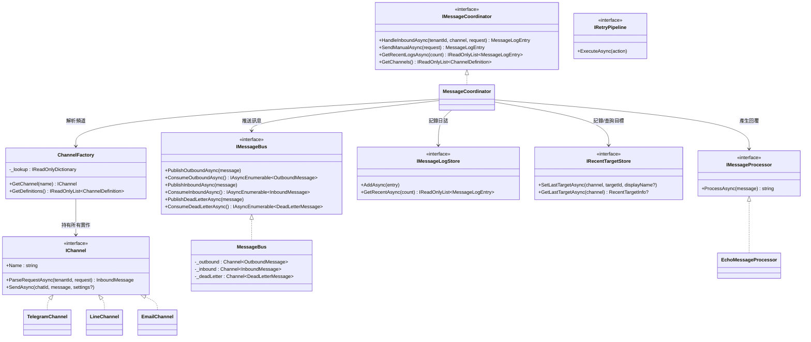
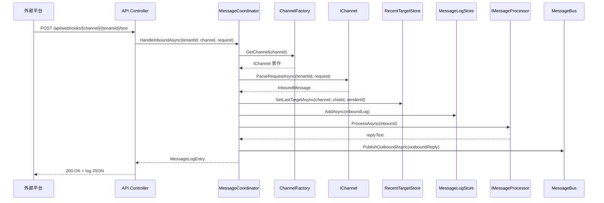
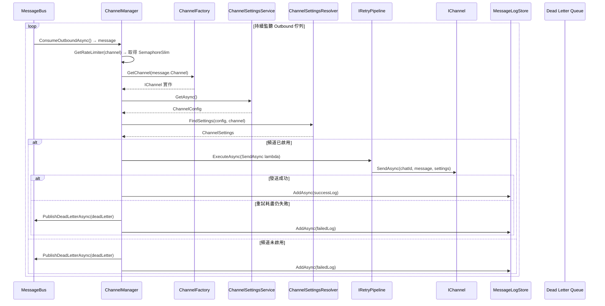

# MessageHub.Core — 核心層技術文件

> **適用對象**：接手工程師、協作 AI Agent  
> **最後更新**：2026-03-24  
> **對應框架**：.NET 8 / C# 12

---

## 1. 一句話摘要

`MessageHub.Core` 專注於通訊核心，定義所有介面契約、資料模型、訊息匯流排、頻道實作與訊息協調邏輯。非通訊核心職責（如設定管理、主動通知、Webhook 驗證、背景調度）已移至 Domain 與 Worker 層，確保 Core 的純粹性。

---

## 2. 核心運作概念（30 秒速覽）

```
外部平台 (Telegram/Line/Email)
        │  Webhook
        ▼
   ┌──────────┐     解析      ┌──────────────────┐     自動回覆     ┌────────────┐
   │ API 層    │ ──────────▶  │ MessageCoordinator │ ─────────────▶  │ MessageBus │
   │ Controller│              │   (協調器)         │                 │  Outbound  │
   └──────────┘              └──────────────────┘                  │  Queue     │
                                     │                              └─────┬──────┘
                                     │ 記錄日誌                           │ 背景消費
                                     ▼                              ┌─────▼──────┐
                              ┌──────────────┐                      │ Worker 層  │
                              │ Infrastructure│                      │ Channel    │
                              │ 層 (SQLite)   │                      │ Manager    │
                              └──────────────┘                      └─────┬──────┘
                                                                          │ 重試 + 發送
                                                                    ┌─────▼──────┐
                                                                    │ IChannel   │
                                                                    │ 實作       │
                                                                    │ (Telegram/ │
                                                                    │  Line/     │
                                                                    │  Email)    │
                                                                    └────────────┘
```

**關鍵流程**：
1. **收訊 (Inbound)**：Webhook → Controller → `MessageCoordinator.HandleInboundAsync` → 解析 + 記錄日誌 + 自動回覆推入 Bus。
2. **發訊 (Outbound)**：控制中心 / 自動回覆 → `MessageBus.PublishOutboundAsync` → `ChannelManager` (Worker 層) 背景消費 → 透過 `IChannel.SendAsync` 實際發送。
3. **失敗處理**：發送失敗由 `ChannelManager` 處理重試或推入 Dead Letter Queue。

---

## 3. 目錄結構與模組對照

```
MessageHub.Core/
├── Models/                  # 資料模型（record / enum）
│   ├── InboundMessage.cs
│   ├── OutboundMessage.cs
│   ├── DeadLetterMessage.cs
│   ├── MessageLogEntry.cs
│   ├── ChannelConfig.cs
│   ├── ChannelSettings.cs
│   ├── ChannelDefinition.cs
│   ├── ChannelTypeDefinition.cs
│   ├── ChannelConfigFieldDefinition.cs
│   ├── SendMessageRequest.cs
│   ├── WebhookTextMessageRequest.cs
│   ├── WebhookVerifyRequest.cs
│   ├── WebhookVerifyResult.cs
│   ├── DeliveryStatus.cs
│   ├── MessageDirection.cs
│   └── RecentTargetInfo.cs
│
├── Stores/Models/           # Store 相關模型
│
├── Bus/                     # 訊息匯流排
│   └── MessageBus.cs            ← IMessageBus 實作（System.Threading.Channels）
│
├── Channels/                # 頻道實作
│   ├── TelegramChannel.cs       ← Telegram Bot API
│   ├── LineChannel.cs           ← LINE Messaging API
│   └── EmailChannel.cs          ← Email（POC no-op）
│
├── Services/                # 業務服務
│   ├── MessageCoordinator.cs    ← 訊息協調器（進站/手動發送/日誌）
│   └── EchoMessageProcessor.cs  ← POC 回覆處理器
│
├── I*.cs                    # 核心介面（共 12 個）
├── ChannelFactory.cs        # 頻道工廠（按名稱查找 IChannel）
├── ChannelSettingsResolver.cs # 頻道設定模糊匹配解析器
└── DependencyInjection.cs   # DI 註冊擴充方法
```

---

## 4. 高層類別圖（UML）

> **註**：`ChannelManager` 已移至 **Worker** 層；`ChannelSettingsService`、`NotificationService` 與 `WebhookVerificationService` 已移至 **Domain** 層。



---

## 5. 核心訊息流循序圖

### 5.1 Inbound 收訊流程

> **註**：`RecentTargetStore` 與 `MessageLogStore` 的實作位於 **Infrastructure** 層（SQLite）。



### 5.2 Outbound 發訊流程（背景）

> **註**：`ChannelManager` 位於 **Worker** 層；`ChannelSettingsService` 位於 **Domain** 層。



---

## 6. 詳細模組文件索引

| # | 文件 | 涵蓋範圍 |
|---|------|---------|
| 1 | [Models — 資料模型](docs/01-models.md) | 所有 record/class/enum 的欄位定義、類別圖與生命週期 |
| 2 | [Interfaces — 核心介面](docs/02-interfaces.md) | 12 個介面的職責、方法簽名與相依關係 |
| 3 | [MessageBus — 訊息匯流排](docs/03-message-bus.md) | MessageBus 的佇列架構（ChannelManager 移至 Worker 層） |
| 4 | [Channels — 頻道實作](docs/04-channels.md) | Telegram/Line/Email 頻道實作（Notification/Webhook 移至 Domain 層） |
| 5 | [Services — 業務服務](docs/05-services.md) | MessageCoordinator 與 EchoProcessor（Settings 移至 Domain 層） |
| 6 | [DI — 相依性注入](docs/07-dependency-injection.md) | 完整服務註冊對照表與生命週期說明 |

---

## 7. 快速理解指南（給 AI Agent）

### 7.1 如果你要新增一個頻道（例如 Discord）

1. 在 `Channels/` 建立 `DiscordChannel.cs`，實作 `IChannel`
2. 在 `DependencyInjection.cs` 加入 `services.AddSingleton<IChannel, DiscordChannel>()`
3. 在 `ChannelSettingsResolver.LooksLikeChannelType` 新增特徵判斷
4. 在 Domain 層的 `ChannelSettingsService.Definitions` 新增欄位定義
5. （選用）在 Domain 層的 `WebhookVerificationService.VerifyAsync` 新增驗證策略

### 7.2 如果你要替換訊息處理邏輯

替換 `EchoMessageProcessor` → 實作 `IMessageProcessor`，在 DI 改註冊即可。

### 7.3 如果你要替換儲存層

- 日誌持久化：實作 `IMessageLogStore` → 目前由 Infrastructure 層提供 SQLite 實作。
- 設定儲存：實作 `IChannelSettingsStore` → 目前由 Domain 層提供 JSON 實作。
- 最近互動目標：實作 `IRecentTargetStore` → 目前由 Infrastructure 層提供 SQLite 實作。

### 7.4 關鍵設計決策

| 決策 | 說明 |
|------|------|
| **發後即忘 (Fire-and-forget)** | `MessageCoordinator` 只推入 Bus，不等待實際發送結果 |
| **內部封裝 (Encapsulation)** | `MessageBus` 為 Core 內部實作；`ChannelManager` (Worker) 與 `NotificationService` (Domain) 亦為各層內部實作 |
| **三條獨立佇列** | Outbound / Inbound / DLQ 完全隔離 |
| **模糊匹配設定** | `ChannelSettingsResolver` 支援 6 種匹配策略（精確→包含→特徵推斷）|

---

## 8. 技術限制與已知邊界（POC 階段）

- **SQLite 持久化**：日誌與最近互動目標已由 Infrastructure 層以 SQLite 持久化，服務重啟後不再遺失。
- **Email 未實作**：`EmailChannel.SendAsync` 為 no-op。
- **無持久化佇列**：`MessageBus` 使用 `System.Threading.Channels`，服務停止則佇列消失。
- **單體部署**：所有元件在同一個 Process 中運行。
- **無認證授權**：API 端點無 Auth 保護。
