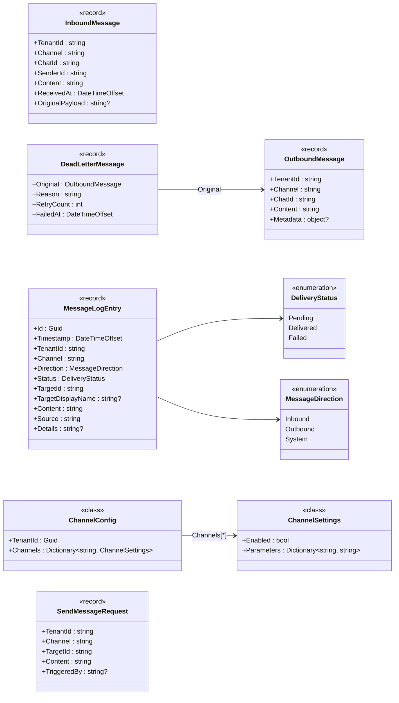

# 01 — Models 資料模型

> 本文件詳述 `MessageHub.Core.Models` 命名空間下的所有資料型別。

---

## 總覽

所有模型皆使用 C# `record` 或 `class`，大多為不可變（immutable）的 `sealed record`，確保訊息物件在傳遞過程中不被意外修改。

| 類型 | 形式 | 用途 |
|------|------|------|
| `InboundMessage` | sealed record | 入站訊息 |
| `OutboundMessage` | sealed record | 出站訊息 |
| `DeadLetterMessage` | sealed record | 死信訊息 |
| `MessageLogEntry` | sealed record | 訊息日誌條目 |
| `SendMessageRequest` | sealed record | 手動發送請求 |
| `WebhookTextMessageRequest` | sealed record | Webhook 文字請求 |
| `WebhookVerifyRequest` | sealed record | Webhook 驗證請求 |
| `WebhookVerifyResult` | sealed record | Webhook 驗證結果 |
| `RecentTargetInfo` | sealed record | 最近互動目標 |
| `ChannelConfig` | sealed class | 頻道總體配置 |
| `ChannelSettings` | sealed class | 單一頻道設定 |
| `ChannelDefinition` | sealed record | 頻道能力定義 |
| `ChannelTypeDefinition` | sealed record | 頻道類型定義 |
| `ChannelConfigFieldDefinition` | sealed record | 設定欄位元資料 |
| `DeliveryStatus` | enum | 投遞狀態列舉 |
| `MessageDirection` | enum | 訊息方向列舉 |

---

## 類別圖



---

## 訊息模型詳解

### InboundMessage（入站訊息）

由各 `IChannel.ParseRequestAsync()` 建立，代表從外部平台進入系統的原始訊息。

| 欄位 | 型別 | 說明 |
|------|------|------|
| `TenantId` | string | 租戶識別碼 |
| `Channel` | string | 來源頻道名稱（`telegram` / `line` / `email`）|
| `ChatId` | string | 聊天室 ID，用於回覆時定位目標 |
| `SenderId` | string | 發送者平台 ID |
| `Content` | string | 訊息純文字內容 |
| `ReceivedAt` | DateTimeOffset | 接收時間（UTC）|
| `OriginalPayload` | string? | 原始 JSON 酬載（供稽核/除錯）|

### OutboundMessage（出站訊息）

由 `MessageCoordinator` 或控制中心建立，排入 `MessageBus` Outbound 佇列。

| 欄位 | 型別 | 說明 |
|------|------|------|
| `TenantId` | string | 租戶識別碼 |
| `Channel` | string | 目標頻道名稱 |
| `ChatId` | string | 目標聊天室 ID |
| `Content` | string | 訊息純文字內容 |
| `Metadata` | object? | 非結構化附加資料（含 `TargetDisplayName`、`TriggeredBy` 等）|

### DeadLetterMessage（死信訊息）

經 `IRetryPipeline` 重試仍失敗時，由 `ChannelManager` 封裝並推入 DLQ。

| 欄位 | 型別 | 說明 |
|------|------|------|
| `Original` | OutboundMessage | 原始出站訊息 |
| `Reason` | string | 失敗原因描述 |
| `RetryCount` | int | 嘗試總次數（含初次）|
| `FailedAt` | DateTimeOffset | 最終失敗時間 |

### MessageLogEntry（訊息日誌條目）

所有進出系統的訊息事件都會建立一筆日誌，供控制中心查詢。

| 欄位 | 型別 | 說明 |
|------|------|------|
| `Id` | Guid | 唯一識別碼 |
| `Timestamp` | DateTimeOffset | 事件發生時間 |
| `TenantId` | string | 租戶識別碼 |
| `Channel` | string | 相關頻道名稱 |
| `Direction` | MessageDirection | 訊息流向 |
| `Status` | DeliveryStatus | 投遞狀態 |
| `TargetId` | string | 目標 ID |
| `TargetDisplayName` | string? | 目標顯示名稱 |
| `Content` | string | 訊息內容摘要 |
| `Source` | string | 觸發來源描述 |
| `Details` | string? | 附加詳細資訊 |

---

## 設定模型詳解

### ChannelConfig（頻道總體配置）

JSON 設定檔反序列化的根物件，以不區分大小寫的字典存放各頻道設定。

```json
{
  "TenantId": "00000000-0000-0000-0000-000000000000",
  "Channels": {
    "telegram": { "Enabled": true, "Parameters": { "BotToken": "..." } },
    "line": { "Enabled": true, "Parameters": { "ChannelAccessToken": "..." } }
  }
}
```

### ChannelSettings（單一頻道設定）

| 欄位 | 型別 | 說明 |
|------|------|------|
| `Enabled` | bool | 頻道是否啟用 |
| `Parameters` | Dictionary<string, string> | 參數字典（鍵不區分大小寫）|

常見參數鍵：

| 頻道 | 參數鍵 | 說明 |
|------|--------|------|
| Telegram | `BotToken` | Bot API Token |
| Telegram | `WebhookUrl` | Webhook 回呼 URL |
| Line | `ChannelAccessToken` | LINE Messaging API Token |
| Line | `ChannelSecret` | LINE Channel Secret |
| Line | `WebhookUrl` | Webhook 回呼 URL |
| Email | `Host` | SMTP 主機位址 |
| Email | `Port` | SMTP 連接埠 |
| Email | `Username` | SMTP 帳號 |
| Email | `Password` | SMTP 密碼 |

---

## 列舉型別

### DeliveryStatus

```
Pending   → 訊息已進入佇列，尚未嘗試發送
Delivered → 訊息已成功發送至目標頻道
Failed    → 訊息發送失敗（含重試耗盡）
```

### MessageDirection

```
Inbound  → 從外部頻道進入系統
Outbound → 從系統發送至外部頻道
System   → 系統內部產生的事件通知
```
