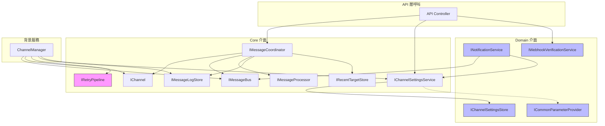

# 02 — Interfaces 核心介面

> 本文件詳述 `MessageHub.Core` 命名空間下的所有介面契約，以及它們的職責邊界與相依關係。

---

## 總覽

`MessageHub.Core` 遵循**介面隔離原則 (ISP)**，將不同職責拆分為獨立介面。Core 層專注於通訊核心契約，共 **8 個介面**：

| 介面 | 職責 | 實作 |
|------|------|------|
| `IChannel` | 頻道通用行為（解析/發送）| TelegramChannel, LineChannel, EmailChannel |
| `IMessageBus` | 三條佇列的生產/消費 | MessageBus |
| `IMessageCoordinator` | 訊息流的高層協調 | MessageCoordinator |
| `IMessageProcessor` | 訊息內容的商業邏輯處理 | EchoMessageProcessor |
| `IRetryPipeline` | 重試策略抽象 | PollyRetryPipeline（Infrastructure 層）|
| `IChannelSettingsService` | 頻道設定 CRUD | ChannelSettingsService（Domain 層）|
| `IMessageLogStore` | 訊息日誌寫入/查詢 | SqliteMessageLogRepository（Infrastructure 層）|
| `IRecentTargetStore` | 最近互動目標記錄 | SqliteRecentTargetStore（Infrastructure 層）|

> **已遷移至 Domain 層的介面**：`IChannelSettingsStore`、`ICommonParameterProvider`、`INotificationService`、`IWebhookVerificationService` 已於重構中移至 `MessageHub.Domain` 命名空間，不再屬於 Core 層。

---

## 介面相依關係圖



> 粉色 `IRetryPipeline` 的實作在 `MessageHub.Infrastructure` 層（Polly）。  
> 藍色介面（`IChannelSettingsStore`、`ICommonParameterProvider`、`INotificationService`、`IWebhookVerificationService`）已移至 `MessageHub.Domain` 層。

---

## 各介面詳解

### IChannel — 頻道通用行為

```csharp
public interface IChannel
{
    string Name { get; }
    Task<InboundMessage> ParseRequestAsync(string tenantId, WebhookTextMessageRequest request, CancellationToken ct);
    Task SendAsync(string chatId, OutboundMessage message, ChannelSettings? settings, CancellationToken ct);
}
```

**職責**：
- `ParseRequestAsync`：將平台特定的 Webhook 請求轉換為統一的 `InboundMessage`
- `SendAsync`：透過平台 API 實際發送訊息

**設計要點**：
- `settings` 參數可選，允許 `ChannelManager` 預先載入設定後傳入，避免重複 I/O
- 每個頻道以 `Name` 屬性作為識別鍵（`telegram` / `line` / `email`）

---

### IMessageBus — 訊息匯流排

```csharp
public interface IMessageBus
{
    // Outbound
    ValueTask PublishOutboundAsync(OutboundMessage message, CancellationToken ct);
    IAsyncEnumerable<OutboundMessage> ConsumeOutboundAsync(CancellationToken ct);
    // Inbound
    ValueTask PublishInboundAsync(InboundMessage message, CancellationToken ct);
    IAsyncEnumerable<InboundMessage> ConsumeInboundAsync(CancellationToken ct);
    // Dead Letter Queue
    ValueTask PublishDeadLetterAsync(DeadLetterMessage message, CancellationToken ct);
    IAsyncEnumerable<DeadLetterMessage> ConsumeDeadLetterAsync(CancellationToken ct);
}
```

**職責**：提供三條獨立的非同步佇列（Outbound / Inbound / DLQ），採用生產者/消費者模式。

**設計要點**：
- 使用 `ValueTask` 最小化分配開銷
- `IAsyncEnumerable` 支援串流式消費，天然支援背壓

---

### IMessageCoordinator — 訊息協調器

```csharp
public interface IMessageCoordinator
{
    Task<MessageLogEntry> HandleInboundAsync(string tenantId, string channel, WebhookTextMessageRequest request, CancellationToken ct);
    Task<MessageLogEntry> SendManualAsync(SendMessageRequest request, CancellationToken ct);
    Task<IReadOnlyList<MessageLogEntry>> GetRecentLogsAsync(int count, CancellationToken ct);
    IReadOnlyList<ChannelDefinition> GetChannels();
}
```

**職責**：高層訊息流協調 — 不直接呼叫 `IChannel.SendAsync`，一律透過 Bus 發後即忘。

**與 IMessageProcessor 的分界**：
- `IMessageCoordinator`：**調度與路由**（解析 → 記錄 → 推送）
- `IMessageProcessor`：**內容處理**（接收 InboundMessage → 產生回覆文字）

---

### IMessageProcessor — 訊息處理器

```csharp
public interface IMessageProcessor
{
    Task<string> ProcessAsync(InboundMessage message, CancellationToken ct);
}
```

**職責**：對入站訊息執行商業邏輯，產生回覆文字。

**擴展點**：目前為 `EchoMessageProcessor`（原樣回傳），未來可替換為 AI 對話引擎、規則引擎等。

---

### IRetryPipeline — 重試管線

```csharp
public interface IRetryPipeline
{
    Task ExecuteAsync(Func<CancellationToken, Task> action, CancellationToken ct);
}
```

**職責**：抽象化重試邏輯，Core 層不依賴具體重試框架。

**實作**：`MessageHub.Infrastructure.PollyRetryPipeline` — 3 次指數退避重試。

---

### IChannelSettingsService — 頻道設定服務

```csharp
public interface IChannelSettingsService
{
    Task<ChannelConfig> GetAsync(CancellationToken ct);
    Task<ChannelConfig> SaveAsync(ChannelConfig config, CancellationToken ct);
    IReadOnlyList<ChannelTypeDefinition> GetChannelTypes();
    string GetSettingsFilePath();
}
```

**職責**：頻道設定的 CRUD 操作與正規化處理。`GetSettingsFilePath()` 回傳設定檔的實際檔案路徑。

**設計說明**：介面定義在 Core 層（因為 Channel 實作直接依賴它），但實作 `ChannelSettingsService` 位於 Domain 層。

---

### IMessageLogStore — 訊息日誌儲存

```csharp
public interface IMessageLogStore
{
    Task AddAsync(MessageLogEntry entry, CancellationToken ct);
    Task<IReadOnlyList<MessageLogEntry>> GetRecentAsync(int count, CancellationToken ct);
}
```

---

### IRecentTargetStore — 最近互動目標儲存

```csharp
public interface IRecentTargetStore
{
    Task SetLastTargetAsync(string channel, string targetId, string? displayName, CancellationToken ct);
    Task<RecentTargetInfo?> GetLastTargetAsync(string channel, CancellationToken ct);
}
```
