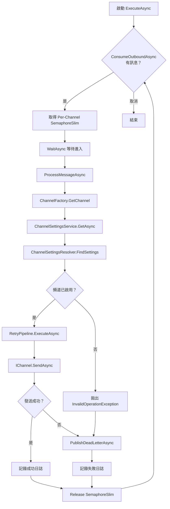
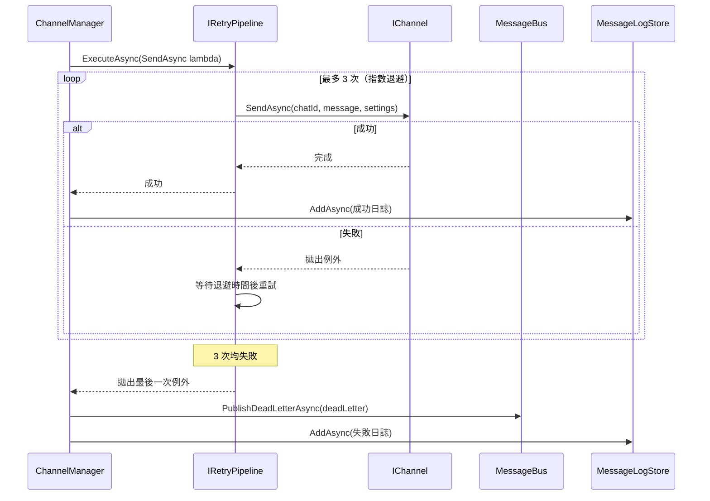

# 03 — MessageBus 訊息匯流排

> 本文件詳述 `Bus/` 資料夾下的 `MessageBus` 與 `ChannelManager`，這是整個系統的訊息傳遞骨幹。

---

## 架構概覽

```
                    ┌─────────────────────────────────────────┐
                    │              MessageBus                  │
                    │                                         │
  PublishOutbound ──▶  ┌──────────┐   ConsumeOutbound ──▶ ChannelManager
                    │  │ Outbound │                          │
                    │  │  Queue   │                          │
                    │  └──────────┘                          │
                    │                                         │
  PublishInbound ───▶  ┌──────────┐   ConsumeInbound ──▶ (未來擴展)
                    │  │ Inbound  │                          │
                    │  │  Queue   │                          │
                    │  └──────────┘                          │
                    │                                         │
  PublishDeadLetter─▶  ┌──────────┐   ConsumeDeadLetter ──▶ (監控儀表板)
                    │  │   DLQ    │                          │
                    │  │  Queue   │                          │
                    │  └──────────┘                          │
                    └─────────────────────────────────────────┘
```

---

## MessageBus（`Bus/MessageBus.cs`）

### 技術選型

使用 `System.Threading.Channels.Channel<T>` 作為底層佇列實作：

- **無界佇列** (`CreateUnbounded`)：不設容量上限，適合 POC 階段
- **多讀多寫** (`SingleReader = false, SingleWriter = false`)：允許多生產者與消費者並行存取
- **零外部相依**：僅使用 .NET BCL，不需 RabbitMQ / Kafka 等中介軟體

### 三條佇列

| 佇列 | 泛型型別 | 生產者 | 消費者 |
|------|---------|--------|--------|
| **Outbound** | `Channel<OutboundMessage>` | MessageCoordinator, NotificationService | ChannelManager |
| **Inbound** | `Channel<InboundMessage>` | （目前未使用，保留擴展）| （目前未使用）|
| **Dead Letter** | `Channel<DeadLetterMessage>` | ChannelManager | （監控儀表板/人工介入）|

### 監控屬性

```csharp
public int OutboundPendingCount => _outbound.Reader.Count;
public int InboundPendingCount  => _inbound.Reader.Count;
public int DeadLetterPendingCount => _deadLetter.Reader.Count;
```

這些屬性可供健康檢查或監控儀表板即時查詢佇列深度。

---

## ChannelManager（`Bus/ChannelManager.cs`）

### 角色

`ChannelManager` 是一個 `BackgroundService`（`IHostedService`），在應用程式啟動時自動啟動，持續監聽 Outbound 佇列並逐一處理訊息。

### 執行流程



### Per-Channel 速率限制

```csharp
private readonly ConcurrentDictionary<string, SemaphoreSlim> _rateLimiters = new(...);

private SemaphoreSlim GetRateLimiter(string channel)
    => _rateLimiters.GetOrAdd(channel, _ => new SemaphoreSlim(1, 1));
```

- 每個頻道名稱對應一個 `SemaphoreSlim(1, 1)`（互斥鎖語意）
- **效果**：同一頻道的訊息串行處理，不同頻道可並行
- **目的**：避免觸發平台 API 的速率限制（Rate Limit）

### 重試與死信流程



### Metadata 處理

`ChannelManager` 使用反射從 `OutboundMessage.Metadata` 提取 `TargetDisplayName`：

```csharp
private static string? ExtractTargetDisplayName(object? metadata)
{
    var property = metadata?.GetType().GetProperty("TargetDisplayName");
    return property?.GetValue(metadata)?.ToString();
}
```

這是刻意的設計：`Metadata` 型別為 `object?`，不同頻道可攜帶不同欄位，保持彈性。

---

## 生命週期

| 元件 | DI 生命週期 | 說明 |
|------|-------------|------|
| `MessageBus` | Singleton | 全域唯一佇列實例 |
| `ChannelManager` | HostedService | 由 .NET 泛型主機管理啟停 |

```csharp
services.AddSingleton<MessageBus>();
services.AddSingleton<IMessageBus>(sp => sp.GetRequiredService<MessageBus>());
services.AddHostedService<ChannelManager>();
```

> `IMessageBus` 介面指向同一個 `MessageBus` Singleton 實例，確保所有注入點共用同一組佇列。
