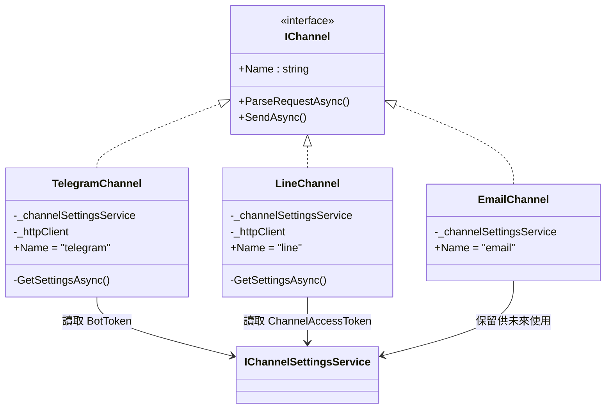
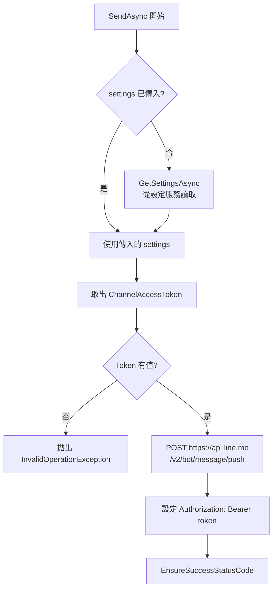
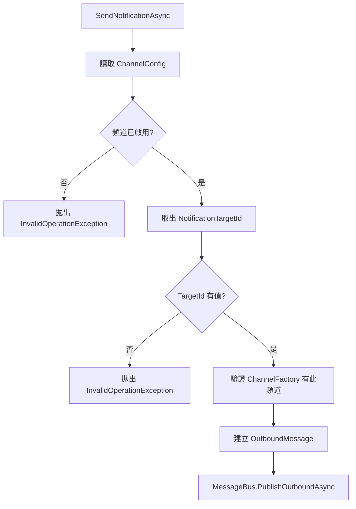
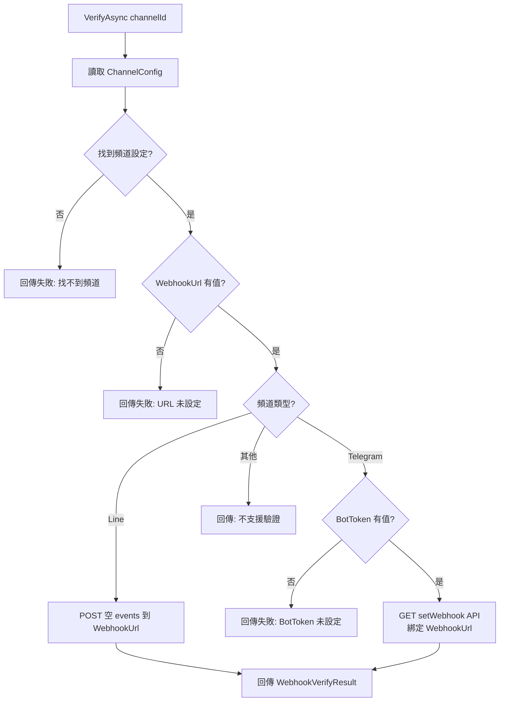

# 04 — Channels 頻道實作

> 本文件詳述 `Channels/` 資料夾下的所有頻道相關實作。

---

## 總覽

| 類別 | 實作介面 | 說明 |
|------|---------|------|
| `TelegramChannel` | `IChannel` | Telegram Bot API 訊息收發 |
| `LineChannel` | `IChannel` | LINE Messaging API 訊息收發 |
| `EmailChannel` | `IChannel` | Email 模擬通道（POC no-op）|
| `NotificationService` | `INotificationService` | 系統主動通知推送 |
| `WebhookVerificationService` | `IWebhookVerificationService` | Webhook 連線驗證 |

---

## 頻道類別圖



---

## TelegramChannel

### ParseRequestAsync

將 `WebhookTextMessageRequest` 直接對映為 `InboundMessage`，無需 Telegram 特定的 Update 物件解析（通用 Webhook 端點已預先簡化）。

### SendAsync 流程

```mermaid
flowchart TD
    A[SendAsync 開始] --> B{settings 已傳入?}
    B -- 否 --> C[GetSettingsAsync<br/>從設定服務讀取]
    B -- 是 --> D[使用傳入的 settings]
    C --> D
    D --> E[取出 BotToken]
    E --> F{BotToken 有值?}
    F -- 否 --> G[拋出 InvalidOperationException]
    F -- 是 --> H[POST https://api.telegram.org<br/>/bot{token}/sendMessage]
    H --> I[EnsureSuccessStatusCode]
```

**API 端點**：`POST https://api.telegram.org/bot{BotToken}/sendMessage`

**Payload 格式**：
```json
{ "chat_id": "目標Chat ID", "text": "訊息內容" }
```

---

## LineChannel

### SendAsync 流程



**API 端點**：`POST https://api.line.me/v2/bot/message/push`

**Payload 格式**：
```json
{
  "to": "目標 User/Group ID",
  "messages": [{ "type": "text", "text": "訊息內容" }]
}
```

**認證方式**：`Authorization: Bearer {ChannelAccessToken}`

---

## EmailChannel

目前為 **POC no-op 實作**：

- `ParseRequestAsync`：正常解析為 `InboundMessage`
- `SendAsync`：直接返回 `Task.CompletedTask`，不執行實際 SMTP 發送

**未來擴展方向**：整合 MailKit 或 SmtpClient，從 `ChannelSettings.Parameters` 讀取 Host / Port / Username / Password。

---

## NotificationService

系統主動通知服務，與一般的訊息收發不同 — 這是**系統主動發起**的推送。

### 流程



**關鍵設定**：頻道的 `Parameters` 中需要有 `NotificationTargetId` 鍵值。

---

## WebhookVerificationService

驗證各頻道的 Webhook URL 是否正確設定並可連線。

### 驗證策略



| 頻道 | 驗證方式 | 說明 |
|------|---------|------|
| **LINE** | POST 空 events | 模擬 Webhook 事件，驗證端點可達 |
| **Telegram** | GET setWebhook | 呼叫 Telegram API 綁定 Webhook URL，同時驗證 BotToken 有效性 |
| **其他** | — | 回傳「不支援」|

---

## 設定讀取共通模式

三個頻道實作（Telegram / Line / Email）都遵循相同的設定讀取模式：

```csharp
// 優先使用外部傳入的 settings（ChannelManager 預載入）
settings ??= await GetSettingsAsync(cancellationToken);

// 從 Parameters 字典取出特定鍵值
var token = settings?.Parameters.GetValueOrDefault("BotToken")?.Trim();
```

**設計意圖**：
- `ChannelManager` 在處理訊息前會預先載入設定，避免每則訊息都讀取 JSON 檔案
- 直接呼叫 `SendAsync` 時（如測試），可不傳 settings，由頻道自行讀取
