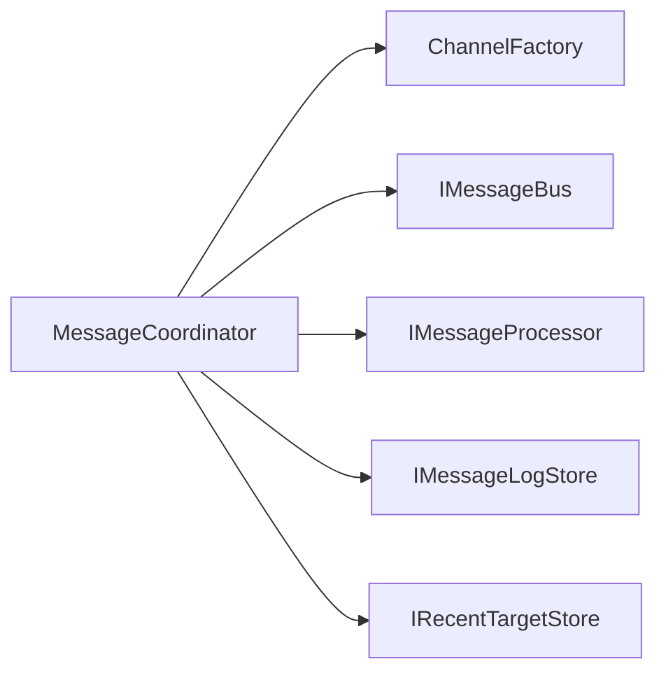
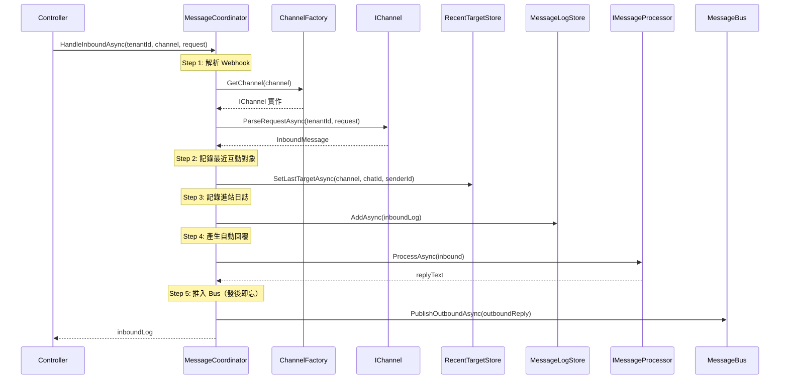
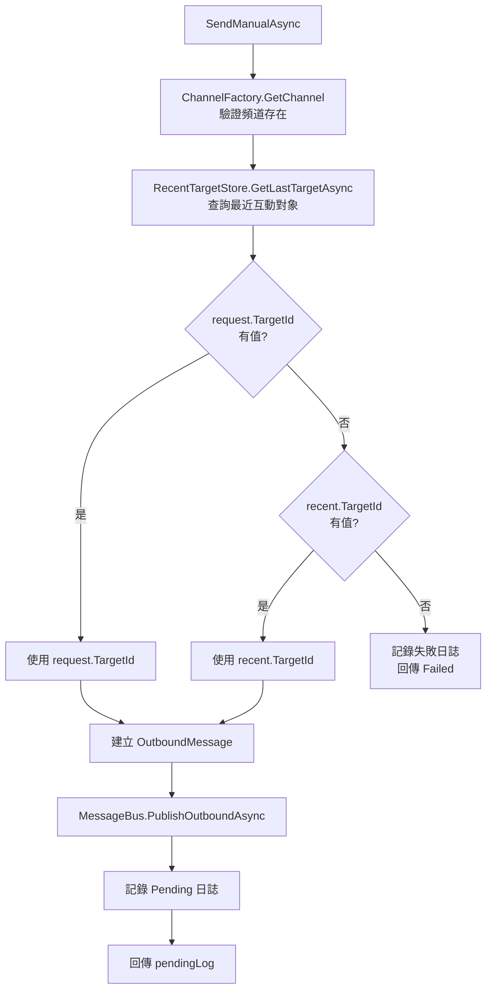
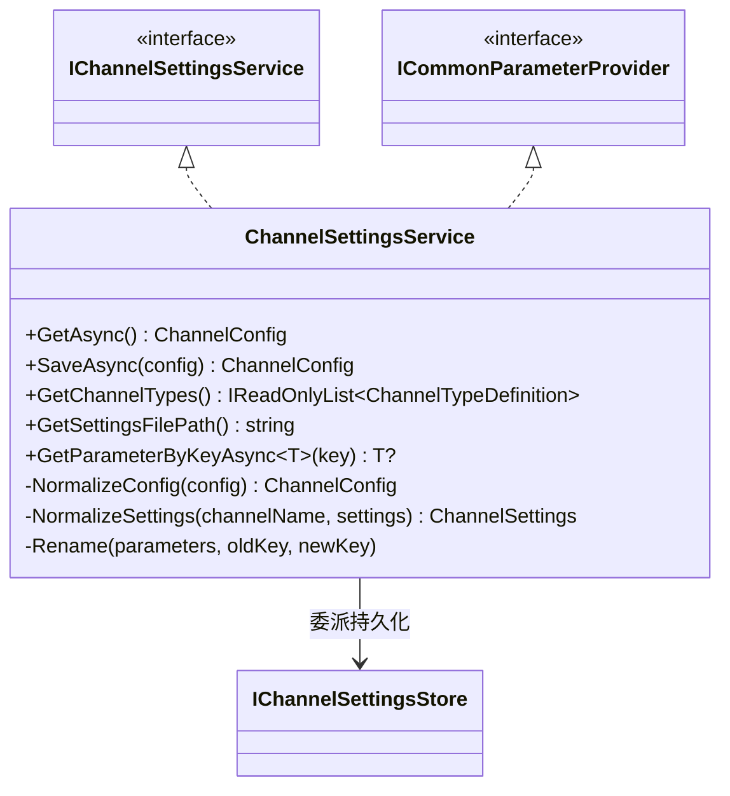
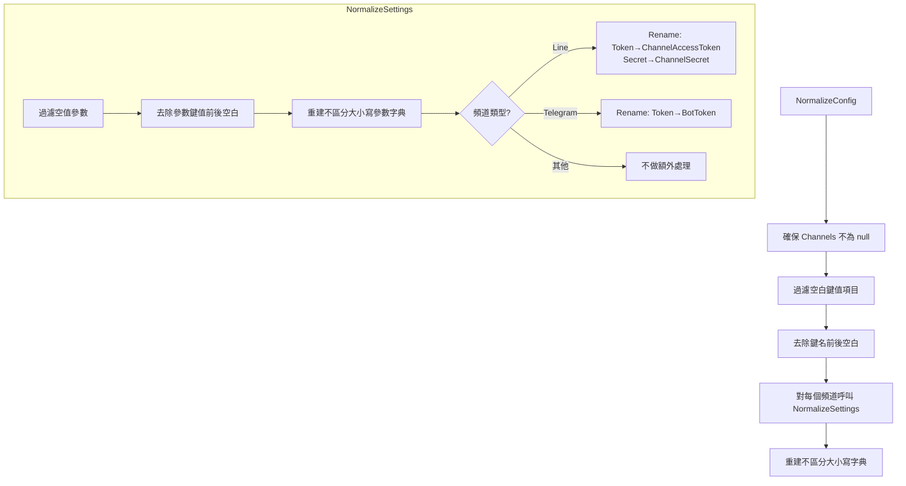

# 05 — Services 業務服務

> 本文件詳述 `Services/` 資料夾下的三個業務服務：MessageCoordinator、ChannelSettingsService、EchoMessageProcessor。

---

## 總覽

| 類別 | 實作介面 | 職責 |
|------|---------|------|
| `MessageCoordinator` | `IMessageCoordinator` | 訊息流的高層協調（進站/手動發送/日誌/頻道清單）|
| `ChannelSettingsService` | `IChannelSettingsService` + `ICommonParameterProvider` | 頻道設定 CRUD + 正規化 + 通用參數查詢 |
| `EchoMessageProcessor` | `IMessageProcessor` | POC 回覆處理器（原樣回傳確認文字）|

---

## MessageCoordinator

### 角色定位

`MessageCoordinator` 是 **API 層與核心層之間的唯一入口**。所有 Controller 的訊息操作都透過它協調，它本身**不直接呼叫** `IChannel.SendAsync`，而是將訊息推入 `MessageBus`，由 `ChannelManager` 背景處理。

### 相依元件



### HandleInboundAsync — 進站訊息處理

處理從 Webhook 進入系統的訊息，完整流程如下：



**重點**：Step 5 是「發後即忘」— API 回應時訊息尚未實際發送，只是排入佇列。

### SendManualAsync — 手動發送

從控制中心發起的訊息發送，包含 targetId 自動解析邏輯：



**TargetId 解析優先順序**：
1. `request.TargetId`（使用者明確指定）
2. `RecentTargetStore` 中該頻道的最近互動對象
3. 若兩者皆無 → 記錄 `Failed` 日誌並回傳

### GetRecentLogsAsync / GetChannels

直接委派至 `IMessageLogStore.GetRecentAsync` 與 `ChannelFactory.GetDefinitions`，無額外邏輯。

---

## ChannelSettingsService

### 雙介面實作

`ChannelSettingsService` 同時實作兩個介面，在 DI 中以同一個 Singleton 實例註冊：



### 正規化流程

每次 `GetAsync` 或 `SaveAsync` 都會自動執行正規化：



### 頻道類型定義（靜態資料）

`Definitions` 是一個靜態的 `IReadOnlyList<ChannelTypeDefinition>`，定義每個頻道需要的設定欄位：

| 頻道 | 欄位 | 必填 | 機密 |
|------|------|------|------|
| **Line** | ChannelAccessToken | Yes | Yes |
| | ChannelSecret | No | Yes |
| | WebhookUrl | No | No |
| | WebhookMode | No | No |
| **Telegram** | BotToken | Yes | Yes |
| | WebhookUrl | No | No |
| | WebhookMode | No | No |
| **Email** | Host | Yes | No |
| | Port | Yes | No |
| | Username | Yes | No |
| | Password | Yes | Yes |

---

## EchoMessageProcessor

最簡單的 `IMessageProcessor` 實作：

```csharp
public Task<string> ProcessAsync(InboundMessage message, CancellationToken ct)
    => Task.FromResult($"[POC 回覆] 已收到：{message.Content}");
```

**擴展方式**：
1. 建立新類別實作 `IMessageProcessor`
2. 在 `DependencyInjection.cs` 替換註冊
3. 可整合 AI 對話引擎（OpenAI / Azure OpenAI）、規則引擎、或多策略路由

---

## ChannelFactory 與 ChannelSettingsResolver

雖然這兩個類別位於根目錄而非 `Services/`，但與業務服務緊密相關：

### ChannelFactory

- 建構時接收 `IEnumerable<IChannel>` → 建立 `Dictionary<string, IChannel>` 查找表
- `GetChannel(name)` → O(1) 查找，找不到拋出 `KeyNotFoundException`
- `GetDefinitions()` → 回傳所有已註冊頻道的 `ChannelDefinition` 清單

### ChannelSettingsResolver

靜態輔助類別，以 6 種策略從 `ChannelConfig` 中模糊匹配頻道設定：

| 優先順序 | 策略 | 範例 |
|---------|------|------|
| 1 | 字典直接查找 | key = `telegram` |
| 2 | 不區分大小寫完整比對 | key = `Telegram` |
| 3 | 前綴比對 | key = `telegram_prod` |
| 4 | 後綴比對 | key = `prod_telegram` |
| 5 | 包含比對 | key = `my-telegram-bot` |
| 6 | 特徵參數推斷 | Parameters 含 `BotToken` → 推斷為 Telegram |
