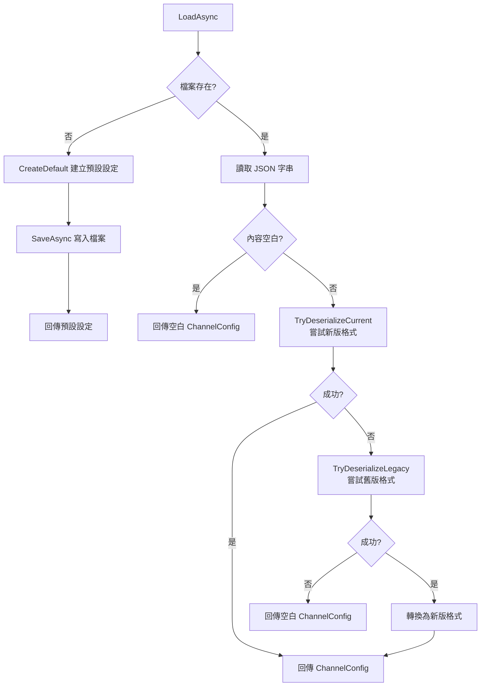

# 06 — Stores 儲存層介面

> 本文件詳述 Core 層定義的儲存介面及其在各層的實作分佈。

---

## 總覽

Core 層定義了儲存相關的介面契約，但**不包含任何儲存實作**。`Stores/` 目錄目前為空，所有儲存實作已分別移至 Domain 層與 Infrastructure 層。

| 介面（Core 層定義） | 實作 | 所在層 | 儲存方式 |
|---------------------|------|--------|---------|
| `IChannelSettingsStore` | `JsonChannelSettingsStore` | **Domain** | JSON 檔案 |
| `IMessageLogStore` | `SqliteMessageLogRepository` | **Infrastructure** | SQLite |
| `IRecentTargetStore` | `SqliteRecentTargetStore` | **Infrastructure** | SQLite |

> **重要變更**：
> - `IChannelSettingsStore` 介面已移至 `MessageHub.Domain` 命名空間，由 Domain 層的 `JsonChannelSettingsStore` 實作。
> - `IMessageLogStore` 與 `IRecentTargetStore` 的介面仍在 Core 層，實作由 Infrastructure 層提供 SQLite 持久化。
> - Core 層原先保留的記憶體實作（`InMemoryMessageLogStore`、`RecentTargetStore`）已不再存在於 `Stores/` 目錄中。

---

## 介面說明

### IMessageLogStore — 訊息日誌儲存

```csharp
public interface IMessageLogStore
{
    Task AddAsync(MessageLogEntry entry, CancellationToken ct);
    Task<IReadOnlyList<MessageLogEntry>> GetRecentAsync(int count, CancellationToken ct);
}
```

**目前實作**：`MessageHub.Infrastructure.SqliteMessageLogRepository`（SQLite 持久化），透過 `AddMessageHubInfrastructure()` 註冊。

### IRecentTargetStore — 最近互動目標儲存

```csharp
public interface IRecentTargetStore
{
    Task SetLastTargetAsync(string channel, string targetId, string? displayName, CancellationToken ct);
    Task<RecentTargetInfo?> GetLastTargetAsync(string channel, CancellationToken ct);
}
```

**目前實作**：`MessageHub.Infrastructure.SqliteRecentTargetStore`（SQLite 持久化），透過 `AddMessageHubInfrastructure()` 註冊。

---

## Domain 層儲存實作

### JsonChannelSettingsStore

`IChannelSettingsStore` 介面與 `JsonChannelSettingsStore` 實作皆位於 Domain 層。

#### 檔案路徑

```csharp
var baseDirectory = AppContext.BaseDirectory;
var dataDirectory = Path.GetFullPath(Path.Combine(baseDirectory, "..", "..", "..", "..", "..", "data"));
_filePath = Path.Combine(dataDirectory, "channel-settings.json");
```

從 `bin/Debug/net8.0/` 向上追溯 5 層到儲存庫根目錄的 `data/` 資料夾。

#### 讀取策略（LoadAsync）



#### 新舊版格式對照

**新版格式**（當前）：
```json
{
  "TenantId": "...",
  "Channels": {
    "telegram": { "Enabled": true, "Parameters": { "BotToken": "..." } }
  }
}
```

**舊版格式**（向下相容讀取）：
```json
{
  "Channels": [
    { "Id": "telegram", "Type": "...", "Enabled": true, "Config": { "Token": "..." } }
  ]
}
```

舊版格式使用陣列結構，`Config` 對應新版的 `Parameters`。`TryDeserializeLegacy` 會自動轉換。

#### 預設設定

首次啟動時自動建立，包含 Line 與 Telegram 兩個頻道：

| 頻道 | 預設 WebhookUrl | 預設模式 |
|------|----------------|---------|
| Line | `https://3vmcf3ql-5001.jpe1.devtunnels.ms/api/line/webhook` | devtunnel |
| Telegram | `https://3vmcf3ql-5001.jpe1.devtunnels.ms/api/telegram/webhook` | devtunnel |

Token 等敏感參數預設為空字串，需手動填入。

#### 序列化選項

```csharp
private static readonly JsonSerializerOptions JsonOptions = new()
{
    WriteIndented = true,       // 縮排輸出，方便人工閱讀
    PropertyNamingPolicy = null  // 保留 PascalCase 屬性名
};
```

#### 限制

- 無檔案鎖定（假設單寫者模式）
- 無併發安全保護（多個 SaveAsync 同時呼叫可能覆蓋彼此）
- 適用 POC 階段，生產環境應替換為資料庫或加上檔案鎖定

---

## 替換指南

若要將儲存實作替換為其他方案：

### 日誌儲存（IMessageLogStore）

目前已由 Infrastructure 層的 `SqliteMessageLogRepository` 提供 SQLite 持久化實作。若要替換：

1. 建立新類別實作 `IMessageLogStore`
2. 在 `Infrastructure/DependencyInjection.cs` 替換註冊
3. 建議支援：分頁查詢、按頻道/方向/狀態篩選、全文搜尋

### 設定儲存（IChannelSettingsStore）

目前由 Domain 層的 `JsonChannelSettingsStore` 提供 JSON 檔案實作。若要替換：

1. 建立新類別（如 `DbChannelSettingsStore`）實作 `IChannelSettingsStore`
2. 在 `Domain/DependencyInjection.cs` 替換註冊
3. 建議支援：併發安全、變更審計、版本控制

### 最近互動目標（IRecentTargetStore）

目前已由 Infrastructure 層的 `SqliteRecentTargetStore` 提供 SQLite 持久化實作。若要替換：

1. 建立新類別實作 `IRecentTargetStore`
2. 在 `Infrastructure/DependencyInjection.cs` 替換
3. 建議支援：每頻道多目標記錄、租戶隔離
