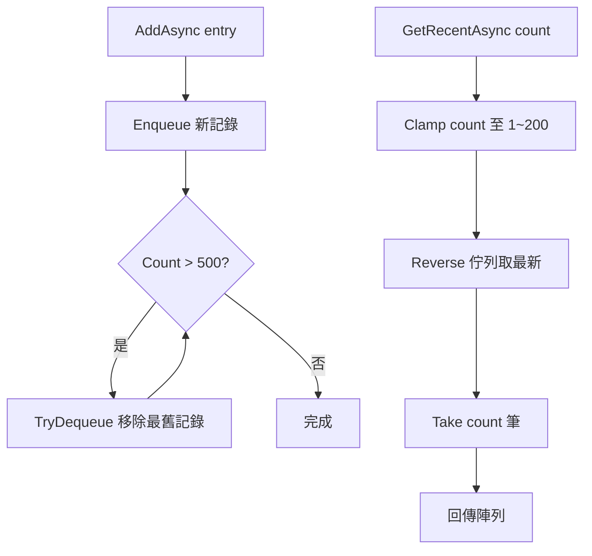
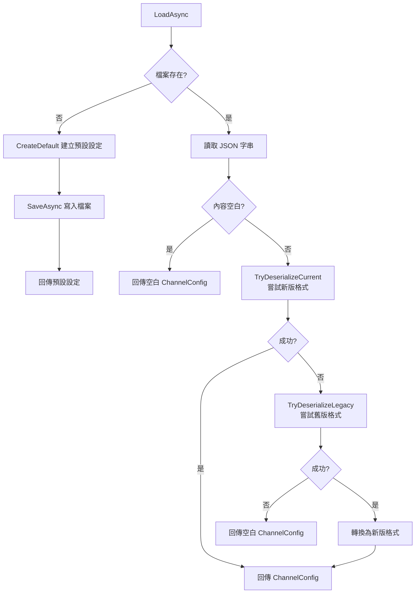
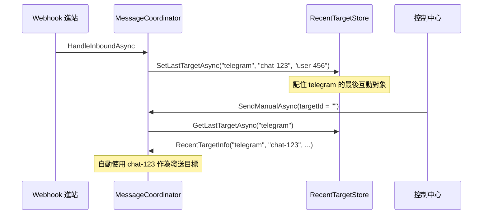

# 06 — Stores 儲存層

> 本文件詳述 `Stores/` 資料夾下的三個儲存實作，以及它們的持久化策略與限制。

---

## 總覽

| 類別 | 實作介面 | 儲存方式 | 持久化 | 執行緒安全 |
|------|---------|---------|--------|-----------|
| `InMemoryMessageLogStore` | `IMessageLogStore` | 記憶體（ConcurrentQueue）| 否 | 是 |
| `JsonChannelSettingsStore` | `IChannelSettingsStore` | JSON 檔案 | 是 | 否（單寫者假設）|
| `RecentTargetStore` | `IRecentTargetStore` | 記憶體（ConcurrentDictionary）| 否 | 是 |

---

## InMemoryMessageLogStore

### 資料結構

```csharp
private readonly ConcurrentQueue<MessageLogEntry> _entries = new();
```

### 容量策略

- **上限**：500 筆（硬編碼）
- **淘汰策略**：滾動視窗 — 新增時若超過上限，從最舊的一端 `TryDequeue`
- **查詢上限**：`GetRecentAsync` 的 count 被 `Math.Clamp(count, 1, 200)` 限制

### 流程圖



### 限制

- 服務重啟後所有日誌遺失
- 無分頁 / 篩選 / 全文搜尋能力
- 適用 POC 階段，生產環境應替換為資料庫實作

---

## JsonChannelSettingsStore

### 檔案路徑

```csharp
var baseDirectory = AppContext.BaseDirectory;
var dataDirectory = Path.GetFullPath(Path.Combine(baseDirectory, "..", "..", "..", "..", "..", "data"));
_filePath = Path.Combine(dataDirectory, "channel-settings.json");
```

從 `bin/Debug/net8.0/` 向上追溯 5 層到儲存庫根目錄的 `data/` 資料夾。

### 讀取策略（LoadAsync）



### 新舊版格式對照

**新版格式**（當前）：
```json
{
  "TenantId": "...",
  "Channels": {
    "telegram": { "Enabled": true, "Parameters": { "BotToken": "..." } }
  }
}
```

**舊版格式**（向下相容讀取）：
```json
{
  "Channels": [
    { "Id": "telegram", "Type": "...", "Enabled": true, "Config": { "Token": "..." } }
  ]
}
```

舊版格式使用陣列結構，`Config` 對應新版的 `Parameters`。`TryDeserializeLegacy` 會自動轉換。

### 預設設定

首次啟動時自動建立，包含 Line 與 Telegram 兩個頻道：

| 頻道 | 預設 WebhookUrl | 預設模式 |
|------|----------------|---------|
| Line | `https://3vmcf3ql-5001.jpe1.devtunnels.ms/api/line/webhook` | devtunnel |
| Telegram | `https://3vmcf3ql-5001.jpe1.devtunnels.ms/api/telegram/webhook` | devtunnel |

Token 等敏感參數預設為空字串，需手動填入。

### 序列化選項

```csharp
private static readonly JsonSerializerOptions JsonOptions = new()
{
    WriteIndented = true,       // 縮排輸出，方便人工閱讀
    PropertyNamingPolicy = null  // 保留 PascalCase 屬性名
};
```

### 限制

- 無檔案鎖定（假設單寫者模式）
- 無併發安全保護（多個 SaveAsync 同時呼叫可能覆蓋彼此）
- 適用 POC 階段，生產環境應替換為資料庫或加上檔案鎖定

---

## RecentTargetStore

### 資料結構

```csharp
private readonly ConcurrentDictionary<string, RecentTargetInfo> _targets
    = new(StringComparer.OrdinalIgnoreCase);
```

### 行為

| 方法 | 說明 |
|------|------|
| `SetLastTargetAsync` | 以頻道名稱為鍵，覆蓋寫入最新的互動目標（含 UTC 時間戳記）|
| `GetLastTargetAsync` | 以頻道名稱查詢最近互動目標，不存在則回傳 `null` |

### 使用場景



### 限制

- 每個頻道只記錄**一個**最近互動目標（不是一個列表）
- 服務重啟後遺失
- 不區分租戶（所有租戶共用同一個 Store）

---

## 替換指南

若要將 POC 的記憶體儲存替換為生產級實作：

### 日誌儲存（IMessageLogStore）

1. 建立新類別（如 `SqlMessageLogStore`）實作 `IMessageLogStore`
2. 在 `DependencyInjection.cs` 替換：
   ```csharp
   services.AddSingleton<IMessageLogStore, SqlMessageLogStore>();
   ```
3. 建議支援：分頁查詢、按頻道/方向/狀態篩選、全文搜尋

### 設定儲存（IChannelSettingsStore）

1. 建立新類別（如 `DbChannelSettingsStore`）實作 `IChannelSettingsStore`
2. 在 `DependencyInjection.cs` 替換
3. 建議支援：併發安全、變更審計、版本控制

### 最近互動目標（IRecentTargetStore）

1. 建立新類別實作 `IRecentTargetStore`
2. 在 `DependencyInjection.cs` 替換
3. 建議支援：每頻道多目標記錄、租戶隔離、持久化
