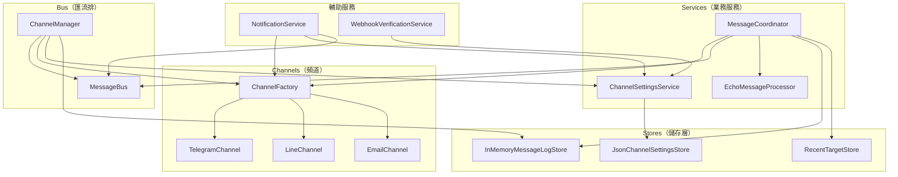

# 07 — Dependency Injection 相依性注入

> 本文件詳述 `DependencyInjection.cs` 中的完整服務註冊架構。

---

## 入口方法

```csharp
public static IServiceCollection AddMessageHubCore(this IServiceCollection services)
```

宿主應用程式（`MessageHub.Api`）只需一行呼叫即可完成 Core 層所有服務的 DI 註冊：

```csharp
builder.Services.AddMessageHubCore();
```

---

## 完整服務註冊對照表

| # | 介面 / 型別 | 實作 | 生命週期 | 說明 |
|---|-------------|------|---------|------|
| 1 | `IMessageLogStore` | `InMemoryMessageLogStore` | Singleton | 記憶體日誌，最多 500 筆 |
| 2 | `IRecentTargetStore` | `RecentTargetStore` | Singleton | 記憶體最近互動目標 |
| 3 | `IChannelSettingsStore` | `JsonChannelSettingsStore` | Singleton | JSON 檔案持久化設定 |
| 4 | `IChannel` | `TelegramChannel` | Singleton | Telegram 頻道 |
| 5 | `IChannel` | `LineChannel` | Singleton | LINE 頻道 |
| 6 | `IChannel` | `EmailChannel` | Singleton | Email 頻道（POC no-op）|
| 7 | `ChannelFactory` | `ChannelFactory` | Singleton | 頻道查找工廠 |
| 8 | `MessageBus`（具體型別）| `MessageBus` | Singleton | 佇列主實例 |
| 9 | `IMessageBus` | → `MessageBus`（委派）| Singleton | 介面指向同一實例 |
| 10 | `ChannelSettingsService`（具體型別）| `ChannelSettingsService` | Singleton | 設定服務主實例 |
| 11 | `IChannelSettingsService` | → `ChannelSettingsService`（委派）| Singleton | 介面指向同一實例 |
| 12 | `ICommonParameterProvider` | → `ChannelSettingsService`（委派）| Singleton | 介面指向同一實例 |
| 13 | `IMessageProcessor` | `EchoMessageProcessor` | Singleton | POC 回覆處理器 |
| 14 | `IMessageCoordinator` | `MessageCoordinator` | Singleton | 訊息協調器 |
| 15 | `INotificationService` | `NotificationService` | Singleton | 主動通知服務 |
| 16 | `IWebhookVerificationService` | `WebhookVerificationService` | Singleton | Webhook 驗證 |
| 17 | `IHostedService` | `ChannelManager` | HostedService | 背景佇列消費者 |

---

## 註冊架構圖



---

## 關鍵設計模式

### 多介面 Singleton 共用實例

當一個類別實作多個介面時，使用委派工廠確保所有介面解析到同一個實例：

```csharp
// MessageBus：具體型別 + 介面指向同一實例
services.AddSingleton<MessageBus>();
services.AddSingleton<IMessageBus>(sp => sp.GetRequiredService<MessageBus>());

// ChannelSettingsService：一個實例同時滿足兩個介面
services.AddSingleton<ChannelSettingsService>();
services.AddSingleton<IChannelSettingsService>(sp => sp.GetRequiredService<ChannelSettingsService>());
services.AddSingleton<ICommonParameterProvider>(sp => sp.GetRequiredService<ChannelSettingsService>());
```

**為什麼不直接 `services.AddSingleton<IMessageBus, MessageBus>()`？**

因為 `ChannelManager` 需要注入具體型別 `MessageBus` 來存取監控屬性（`OutboundPendingCount` 等），如果直接註冊介面，則無法注入具體型別。

### 多實作 IChannel 註冊

```csharp
services.AddSingleton<IChannel, TelegramChannel>();
services.AddSingleton<IChannel, LineChannel>();
services.AddSingleton<IChannel, EmailChannel>();
```

DI 容器會收集所有 `IChannel` 註冊，`ChannelFactory` 透過 `IEnumerable<IChannel>` 注入取得全部實作。

### HostedService 註冊

```csharp
services.AddHostedService<ChannelManager>();
```

`ChannelManager` 的生命週期由 .NET 泛型主機管理：
- 應用程式啟動時呼叫 `StartAsync` → `ExecuteAsync` 開始監聽佇列
- 應用程式關閉時觸發 `CancellationToken` → `ExecuteAsync` 的 foreach 迴圈自然結束

---

## 全部 Singleton 的設計考量

所有服務均註冊為 **Singleton**，原因：

1. **記憶體儲存**：`InMemoryMessageLogStore`、`RecentTargetStore` 需要跨請求共享資料
2. **佇列共享**：`MessageBus` 必須全域唯一，所有生產者/消費者共用同一組佇列
3. **HttpClient 重用**：頻道實作內建 `HttpClient`，避免 Socket 耗盡
4. **設定快取**：`ChannelSettingsService` 作為 Singleton 可在後續版本加入記憶體快取

**注意事項**：Singleton 意味著所有服務必須是執行緒安全的。目前的實作透過 `ConcurrentQueue`、`ConcurrentDictionary` 和 `SemaphoreSlim` 達成。

---

## 新增頻道的 DI 變更清單

若要新增一個頻道（例如 Discord）：

```csharp
// 1. 在 Channels 區塊加入新頻道
services.AddSingleton<IChannel, DiscordChannel>();

// 就這樣！ChannelFactory 會自動收集所有 IChannel 實作
```

無需修改 `ChannelFactory`、`ChannelManager` 或 `MessageCoordinator`。
